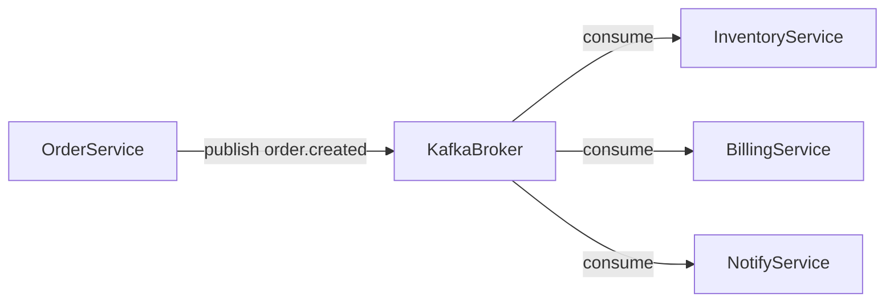
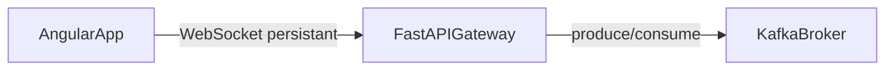

# Petit cours Apache Kafka

Niveau : débutant / intermédiaire  
Objectif : comprendre Kafka, l’installer (Docker ou natif), et l’utiliser comme message broker dans une architecture répartie.

---

## 1. Pourquoi Kafka ?

Apache Kafka est une plateforme de **streaming d’événements** basée sur un **log distribué**.

Elle sert à :

- **découpler** les services (le producteur n’attend pas le consommateur) ;
- **transporter** de gros volumes de messages avec un fort débit ;
- **conserver** les messages pendant une durée configurable (rétention), ce qui permet le *replay* ;
- **alimenter** plusieurs consommateurs en parallèle à partir du même flux d’événements.

Contrairement à une file classique « consommer = supprimer », Kafka **conserve** les messages dans un log. Les consommateurs avancent via un **offset** (position de lecture).

---

## 2. Concepts essentiels

| Concept | Rôle |
|--------|------|
| **Broker** | Serveur Kafka qui stocke et sert les messages |
| **Cluster** | Ensemble de brokers qui collaborent |
| **Topic** | Canal nommé (ex. `order.created`) |
| **Partition** | Subdivision d’un topic pour le parallélisme et la scalabilité |
| **Offset** | Position d’un message dans une partition |
| **Producer** | Application qui publie des messages dans un topic |
| **Consumer** | Application qui lit des messages depuis un topic |
| **Consumer group** | Groupe de consommateurs qui se partagent les partitions |
| **Réplication** | Copies des partitions sur plusieurs brokers pour la résilience |

### Schéma mental

```
Producer  -->  Topic (partitions)  -->  Consumer(s) / Consumer group
                    |
                 Brokers
```

- Un message appartient à **une** partition.
- Dans un consumer group, **une partition** est lue par **un seul** membre du groupe à la fois.
- Plusieurs groupes peuvent lire le **même** topic indépendamment (chacun son offset).

### KRaft (sans ZooKeeper)

Les versions récentes de Kafka gèrent le consensus via **KRaft**. ZooKeeper n’est plus nécessaire pour un cluster moderne. La démo de ce dépôt utilise ce mode.

---

## 3. Kafka comme message broker

Dans une architecture répartie (microservices, event-driven), Kafka joue souvent le rôle de **bus d’événements** :

1. Un service publie un événement (`order.created`).
2. Kafka le stocke dans un topic.
3. D’autres services s’abonnent et réagissent (stock, facturation, notification).



### Avantages pour le découplage

- Le service commandes ne connaît pas les consommateurs.
- On peut ajouter un nouveau service (analytics, audit) sans modifier le producteur.
- Si un consommateur est en panne, les messages restent disponibles (rétention).
- On peut **rejouer** l’historique pour reconstruire un état ou déboguer.

### Kafka vs RabbitMQ (aperçu)

| | Kafka | RabbitMQ |
|--|-------|----------|
| Modèle | Log / flux d’événements | Files + exchanges (AMQP) |
| Rétention | Oui (durée / taille) | En général jusqu’à ack |
| Replay | Naturel (repositionner l’offset) | Moins naturel |
| Débit | Très élevé, conçu pour le streaming | Excellent pour le messaging classique |
| Cas typique | Event sourcing, pipelines, microservices événementiels | Work queues, routage riche, RPC-like |

Les deux peuvent servir de message broker. Kafka brille quand on veut un **historique partagé**, du **replay** et du **haut débit** entre services.

Cours dédié RabbitMQ (STOMP Angular, microservices, fédération) : [COURS_RABBITMQ.md](COURS_RABBITMQ.md).

### Cas d’usage courants

- Communication asynchrone entre microservices
- Ingestion de logs / métriques / clics
- Pipeline ETL / data lake
- Notification et traitements en arrière-plan
- CDC (Change Data Capture) depuis une base

---

## 4. Installation

### 4.1 Docker (recommandé)

Prérequis : Docker et Docker Compose.

Depuis la racine de ce dépôt :

```bash
docker compose up -d
```

Kafka écoute sur **`localhost:9092`**.

Vérifier :

```bash
docker compose ps
docker compose logs -f kafka
```

Arrêter :

```bash
docker compose down
```

Le fichier [`docker-compose.yml`](docker-compose.yml) démarre un broker unique en mode KRaft, adapté au développement local.

### 4.2 Installation directe (binaire Apache Kafka)

Utile pour comprendre le runtime sans Docker.

1. Installer un **JDK 17+**.
2. Télécharger Kafka sur [https://kafka.apache.org/downloads](https://kafka.apache.org/downloads).
3. Extraire l’archive, puis (exemple KRaft, chemins adaptés à votre version) :

```bash
# Générer un UUID de cluster (une fois)
KAFKA_CLUSTER_ID="$(bin/kafka-storage.sh random-uuid)"

# Formater le stockage
bin/kafka-storage.sh format -t "$KAFKA_CLUSTER_ID" -c config/kraft/server.properties

# Démarrer le broker
bin/kafka-server-start.sh config/kraft/server.properties
```

Par défaut, le broker local est souvent joignable sur `localhost:9092` (selon `server.properties`).

> Pour ce cours, privilégiez Docker : moins d’étapes, reproductible, aligné avec la démo Python.

---

## 5. Utilisation

### 5.1 CLI dans le conteneur

Créer un topic :

```bash
docker exec -it kafka /opt/kafka/bin/kafka-topics.sh \
  --bootstrap-server localhost:9092 \
  --create --topic demo-events \
  --partitions 1 --replication-factor 1
```

Lister les topics :

```bash
docker exec -it kafka /opt/kafka/bin/kafka-topics.sh \
  --bootstrap-server localhost:9092 --list
```

Producteur console :

```bash
docker exec -it kafka /opt/kafka/bin/kafka-console-producer.sh \
  --bootstrap-server localhost:9092 --topic demo-events
```

Consommateur console (depuis le début) :

```bash
docker exec -it kafka /opt/kafka/bin/kafka-console-consumer.sh \
  --bootstrap-server localhost:9092 \
  --topic demo-events --from-beginning
```

### 5.2 Démo Python

Voir le dossier [`demo/`](demo/) et le [`README.md`](README.md) :

- `producer.py` publie des événements JSON sur `demo-events`
- `consumer.py` les lit en boucle (groupe `demo-group`)

Flux typique :

1. `docker compose up -d`
2. Terminal A : lancer le consumer
3. Terminal B : lancer le producer
4. Observer les messages arriver côté consumer

### 5.3 Angular et connexion persistante

Contrairement à RabbitMQ (plugin STOMP/WebSocket, clients navigateur directs), **Kafka n’offre pas de protocole navigateur**. Un client Angular ne peut pas ouvrir une connexion Kafka native.

Le pattern standard est un **gateway** :



| | RabbitMQ + Angular | Kafka + Angular |
|--|--------------------|-----------------|
| Connexion navigateur | STOMP / MQTT / AMQP via plugin Web | Pas de client Kafka navigateur |
| Persistance côté UI | WebSocket (souvent STOMP) | WebSocket vers un **bridge** |
| Qui parle au broker | Navigateur (via plugin) ou backend | Toujours un backend / gateway |

Dans ce dépôt :

- [`gateway/`](gateway/) — FastAPI : `WS /ws` produit et consomme sur `demo-events`
- [`frontend/`](frontend/) — Angular : service WebSocket, envoi + réception live

```bash
docker compose up -d          # Kafka + gateway (:8000)
cd frontend && npm start      # Angular sur :4200
```

L’UI se connecte à `ws://localhost:8000/ws`. Les messages publiés transitent par Kafka et sont renvoyés en push à tous les clients WebSocket connectés.

---

## 6. Architecture répartie : bonnes pratiques de base

- **Nommer les topics par événement métier** : `order.created`, `payment.completed`.
- **Une responsabilité par consommateur** : inventaire ≠ facturation ≠ notification.
- **Idempotence côté consommateur** : un message peut être retraité (at-least-once).
- **Clé de message** : utiliser une clé (ex. `order_id`) pour ordonner les événements d’une même entité dans une partition.
- **Ne pas traiter Kafka comme une base de données métier** : c’est un log de transport / d’événements ; persistez l’état dans vos stores applicatifs.
- **Monitoring** : lag des consumer groups, disque, réplication (en prod : plusieurs brokers).

### Passage à l’échelle (aperçu)

| Besoin | Levier |
|--------|--------|
| Plus de débit en écriture / lecture | Plus de partitions |
| Plus de consommateurs en parallèle | Plus de membres dans le consumer group (≤ nb partitions) |
| Haute disponibilité | Plusieurs brokers + `replication.factor` > 1 |

---

## 7. Pour aller plus loin

Hors scope de ce petit cours, mais utiles ensuite :

- Cluster multi-brokers
- Sécurité (SASL / TLS)
- Schema Registry (Avro / Protobuf)
- Kafka Connect, Kafka Streams / ksqlDB
- Exactly-once et transactions

---

## Résumé

1. Kafka = log distribué pour événements à haut débit, avec rétention et replay.  
2. Topics + partitions + offsets + consumer groups = modèle de base.  
3. Excellent message broker pour découpler des services en architecture répartie.  
4. Docker Compose suffit pour démarrer en local ; la démo Python illustre le cycle publier / consommer.  
5. Pour Angular, une connexion « persistante » passe par un gateway WebSocket (pas de STOMP natif Kafka).
