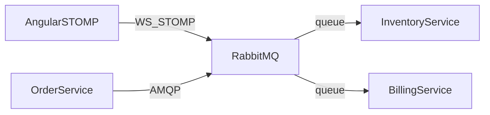
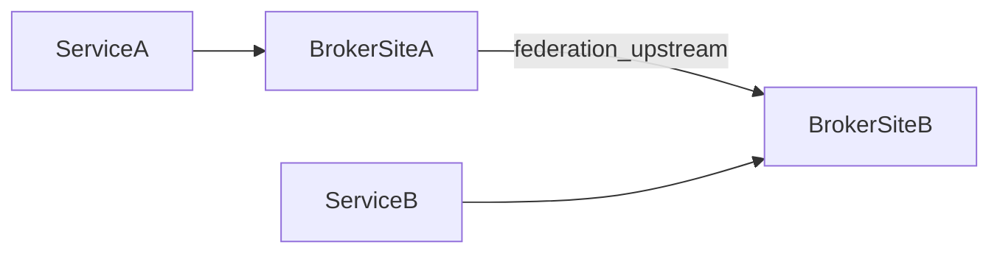

# Petit cours RabbitMQ

Niveau : débutant / intermédiaire  
Objectif : comprendre RabbitMQ, l’utiliser comme message broker entre microservices (et au-delà : jobs, notifs, buffer…), le brancher à Angular (STOMP), et situer la **fédération**.

---

## 1. Pourquoi RabbitMQ ?

RabbitMQ est un **message broker** AMQP largement utilisé pour :

- **découpler** producteurs et consommateurs ;
- **router** les messages (exchanges + routing keys) ;
- gérer des **files de travail** (work queues) avec accusés de réception (*ack*) ;
- exposer des protocoles utiles au navigateur (**STOMP over WebSocket**).

Contrairement à Kafka (log d’événements avec rétention longue et replay), RabbitMQ se concentre sur la **livraison de messages** vers des files : une fois consommés et *ack*, ils disparaissent en général de la file.

---

## 2. Concepts essentiels

| Concept | Rôle |
|--------|------|
| **Producer** | Publie un message vers un *exchange* |
| **Exchange** | Route le message selon son type et la *routing key* |
| **Binding** | Lien exchange → queue (avec une clé ou un motif) |
| **Queue** | File où les messages attendent d’être consommés |
| **Consumer** | Lit et traite les messages (souvent avec *ack*) |
| **Routing key** | Étiquette utilisée pour le routage |
| **Durable / persistent** | Survive au redémarrage du broker (selon config) |

### Types d’exchange courants

| Type | Comportement |
|------|----------------|
| **direct** | Routing key exacte |
| **fanout** | Broadcast à toutes les queues liées |
| **topic** | Motifs (`order.*`, `*.created`) |
| **headers** | Routage sur en-têtes |

### Schéma mental

```
Producer → Exchange → (bindings) → Queue(s) → Consumer(s)
```

---

## 3. RabbitMQ comme broker de microservices

Dans une architecture répartie, RabbitMQ sert de **bus asynchrone** :



Exemples de patterns :

- **Work queue** : plusieurs workers se partagent une file (tâches lourdes).
- **Pub/Sub (fanout / topic)** : un événement `order.created` notifie plusieurs services.
- **RPC-like** : file de requête + file de réponse (corrélation).

### Avantages pour les microservices

- Le producteur ignore qui consomme.
- On ajoute un service (notifications, analytics) sans modifier le producteur.
- Back-pressure et retries via *nack* / *dead-letter* (selon config).
- Angular peut s’abonner en direct via STOMP (temps réel UI).

### Kafka vs RabbitMQ (rappel)

| | Kafka | RabbitMQ |
|--|-------|----------|
| Modèle | Log / streaming | Files + exchanges |
| Replay | Naturel (offsets) | Limité |
| Navigateur | Bridge WebSocket nécessaire | STOMP/WebSocket natif (plugin) |
| Cas typique | Pipelines, event log | Work queues, routage riche, UI live |

Voir aussi [COURS_KAFKA.md](COURS_KAFKA.md).

---

## 4. Au-delà du message broker : autres usages

RabbitMQ reste centré sur le **transport et le routage de messages**, mais on l’emploie souvent pour des rôles plus précis que « bus générique entre services ».

| Usage | Idée |
|--------|------|
| **Work queues / jobs** | Distribuer des tâches lourdes à des workers |
| **Pub/Sub & notifications** | Diffuser un événement à plusieurs abonnés (dont une UI Angular) |
| **RPC asynchrone** | Requête / réponse via files + *correlation id* |
| **Buffer anti-surcharge** | Absorber les pics pour protéger APIs et bases |
| **Orchestration légère** | Chaîner des étapes de workflow entre services |
| **Multi-protocoles** | AMQP, STOMP, MQTT (IoT) vers les mêmes files |
| **Federation / Shovel** | Relier des sites ou déplacer des flux entre brokers |
| **Dead-letter / retry** | Isoler les échecs pour reprise ou audit |

### Exemples concrets

1. **Envoi d’emails** — l’API publie sur la file `mail.send` ; des workers SMTP consomment à leur rythme (pas de timeout HTTP côté utilisateur).
2. **Génération PDF / images** — un message `report.generate` déclenche un worker CPU-intensif ; le résultat est stocké (S3, disque) puis notifié.
3. **Statut commande en live** — le service commandes publie `order.status` ; Angular s’abonne en STOMP et met à jour l’UI sans polling.
4. **Pic d’inscriptions** — les formulaires poussent des messages `user.register` ; un consommateur écrit en base à débit maîtrisé (file = tampon).
5. **Capteurs IoT** — des devices MQTT publient des mesures ; RabbitMQ les route vers des files métier (`telemetry.temperature`, alertes).

### Ce que ce n’est pas

- **Pas une base de données** : ne stockez pas l’état métier durable dans les files.
- **Pas un log rejouable type Kafka** : la rétention longue et le replay ne sont pas le modèle natif.
- **Pas un cache** (Redis) ni un scheduler dédié : on peut improviser des patterns, mais ce n’est pas le bon outil principal.

En résumé : hors le label « broker », RabbitMQ sert surtout de **file de travail**, **bus d’événements court terme**, **pont d’intégration** et **mécanisme de découplage / résilience**.

---

## 5. Angular : connexion persistante (STOMP)

RabbitMQ propose le plugin **`rabbitmq_web_stomp`** : le navigateur ouvre un **WebSocket** et parle **STOMP**.

```
Angular  --STOMP/WS-->  RabbitMQ  --AMQP-->  Microservices
```

Dans ce dépôt :

- broker : `ws://localhost:15674/ws` (guest/guest en local uniquement) ;
- file démo : `/queue/demo-angular` ;
- service Angular : `RabbitStompService` (`@stomp/rx-stomp`).

| | RabbitMQ + Angular | Kafka + Angular (ce dépôt) |
|--|--------------------|----------------------------|
| Protocole UI | STOMP over WebSocket | WebSocket custom |
| Qui parle au broker | Angular → RabbitMQ | Angular → gateway → Kafka |
| Plugin / composant | `rabbitmq_web_stomp` | FastAPI `gateway/` |

---

## 6. Fédération : deux sens du mot

### 6.1 Architecture de microservices « fédérés »

Plusieurs services / équipes partagent un **bus de messages** (RabbitMQ) sans monolithe :

- chaque service publie ses événements ;
- d’autres s’abonnent via queues / topics ;
- l’UI Angular peut écouter des événements métier (statut commande, alertes).

C’est le cas pédagogique principal de ce cours.

### 6.2 Plugin RabbitMQ Federation

**Federation** est aussi un *plugin* RabbitMQ qui **relie plusieurs brokers** (sites, datacenters, clouds) :

- un broker « aval » peut recevoir des messages d’un broker « amont » ;
- utile pour multi-région, partenaires, isolation réseau ;
- distinct de *Shovel* (transfert plus ponctuel / file à file).

Pour ce petit cours : on mentionne le plugin ; on ne déploie pas de multi-broker.



---

## 7. Installation

### 7.1 Docker (recommandé)

Depuis la racine du dépôt :

```bash
docker compose up -d rabbitmq
```

Ports :

| Port | Usage |
|------|--------|
| `5672` | AMQP (microservices) |
| `15672` | UI Management (`http://localhost:15672`) |
| `15674` | Web-STOMP (`ws://localhost:15674/ws`) |

Identifiants par défaut (dev local) : `guest` / `guest`.

### 7.2 Installation native (aperçu)

1. Installer Erlang + RabbitMQ (paquets officiels selon l’OS).
2. Activer les plugins :

```bash
rabbitmq-plugins enable rabbitmq_management rabbitmq_web_stomp
```

3. Démarrer le service `rabbitmq-server`.

---

## 8. Utilisation / démo

### Management UI

Ouvrir [http://localhost:15672](http://localhost:15672) → login `guest`/`guest` → onglets Queues, Exchanges, Connections.

### Angular

```bash
docker compose up -d
cd frontend && npm start
```

Dans l’UI ([http://localhost:4200](http://localhost:4200)) : onglet **RabbitMQ (STOMP)** → Connecter → publier → voir le message revenir sur `/queue/demo-angular`.

### CLI (optionnel, dans le conteneur)

```bash
docker exec -it rabbitmq rabbitmqctl status
docker exec -it rabbitmq rabbitmqadmin list queues
```

---

## 9. Scalabilité

Oui — **RabbitMQ est scalable**, surtout en **scale-out** (plusieurs nœuds / workers) et en **scaling des consommateurs**, pas sur le même modèle que Kafka (partitions + log massif).

### Leviers

| Levier | Effet |
|--------|--------|
| **Plusieurs consumers** sur une même file | Débit de traitement ↑ (work queue) |
| **Plusieurs files / exchanges** | Isolation des flux métier |
| **Cluster RabbitMQ** | Plusieurs brokers, haute dispo, répartition des files (selon config) |
| **Quorum queues** | Réplication moderne, plus robuste que les mirrored queues classiques |
| **Fédération / Shovel** | Scale « géographique » entre sites / clouds |
| **Ressources** | CPU, RAM, disque, réseau — souvent le vrai goulot |

### Limites

- Moins pensé pour le **très haut débit de streaming** / rétention longue que Kafka.
- Un **cluster** ajoute de la complexité (réseau, split-brain, policies).
- Une **file très chaude** (une seule file énorme) peut devenir un point de contention : mieux vaut **partitionner logiquement** (plusieurs files / sharding applicatif).
- La scalabilité **écriture + historique rejouable** reste plutôt le terrain de Kafka.

### En pratique

- **Apps / microservices** : très scalable via workers et files dédiées.
- **Pipelines data / millions msg/s en log d’événements** : plutôt Kafka.
- **Trafic métier + jobs + notifs** : RabbitMQ scale bien avec un bon design de files et, si besoin, un cluster + quorum queues.

---

## 10. Bonnes pratiques de base

- Nommer clairement exchanges / queues (`orders.created`, `billing.jobs`).
- Préférer messages **persistants** + queues **durables** pour les flux critiques.
- Toujours *ack* après traitement réussi ; utiliser une *dead-letter queue* pour les échecs.
- Ne pas exposer `guest`/`guest` hors de localhost.
- Pour multi-site : étudier **Federation** ou **Shovel** plutôt que de coller les apps au même broker distant.

---

## 11. Pour aller plus loin

- Confirms publisher, quorum queues
- Policies, TTL, DLX
- Federation / Shovel multi-broker
- Sécurité TLS + utilisateurs / vhosts
- Comparaison fine avec Kafka Streams / event sourcing
- Clustering et tuning de performance

---

## Résumé

1. RabbitMQ = broker AMQP (exchanges, queues, ack, routage riche).  
2. Excellent bus pour microservices et work queues.  
3. Autres usages courants : jobs (emails, PDF), notifs live, RPC async, buffer, IoT/MQTT, DLQ — pas une BDD ni un cache.  
4. **Scalable** via consumers, files, cluster / quorum queues ; Kafka reste préférable pour le streaming massif et le replay.  
5. Angular se connecte en **STOMP/WebSocket** sans gateway dédié.  
6. « Fédération » = architecture de services autour d’un bus, *ou* plugin multi-broker.  
7. La démo du dépôt illustre Angular ↔ RabbitMQ en local via Docker.
