# Procédure : conception d’une architecture d’application répartie

Niveau : intermédiaire  
Objectif : suivre une **méthode étape par étape** pour concevoir, livrer et contrôler une application répartie, avec les **outils / logiciels / frameworks** adaptés à chaque phase.

Stack de référence de ce dépôt (exemples) : **Angular** + **RabbitMQ (STOMP)** / **Kafka (gateway)** + **Docker Compose**.  
Cours associés : [COURS_KAFKA.md](COURS_KAFKA.md), [COURS_RABBITMQ.md](COURS_RABBITMQ.md).

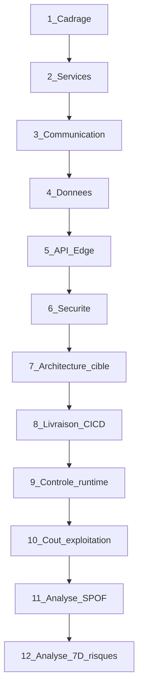

Pour **chaque étape** ci-dessous : objectif → livrables → outils recommandés.

---

# Partie A — Conception

## 1. Cadrage métier et exigences

### Objectif

Clarifier le problème, les acteurs, les parcours critiques et les contraintes non fonctionnelles (NFR) avant de découper des services.

### Livrables

- Vision produit / périmètre (in / out)
- Personas et parcours principaux
- Exigences fonctionnelles (user stories / jobs-to-be-done)
- NFR chiffrés : latence, disponibilité, volume, RPO/RTO, conformité
- Premiers **ADR** (Architecture Decision Records) si des choix structurants apparaissent tôt

### Outils / logiciels / frameworks

| Besoin | Outils |
|--------|--------|
| Ateliers, cartographie | Miro, FigJam, Whimsical |
| Backlog & docs | Notion, Confluence, GitHub Issues / Projects |
| Exigences versionnées | Markdown dans le repo, ADR (`adr-tools` ou dossier `docs/adr/`) |
| Estimation charge | Google Sheets / Excel, ou métriques métier déjà connues |

### Points d’attention

- Distinguer **besoin métier** et **solution technique** trop tôt.
- Les NFR orientent déjà sync vs async, choix broker, multi-région, etc.

---

## 2. Découpage en services (DDD light)

### Objectif

Identifier des **limites de responsabilité** (bounded contexts) pour éviter le monolithe distribué, puis en dériver des **services** et des **contrats API** (sync et async).

### Livrables

- Context map (relations entre domaines)
- Liste de services candidats (nom, responsabilité, propriétaire d’équipe)
- Contrats d’interface préliminaires (API / événements)
- Règle : **une base de données par service** (logique)
- Artefacts Synergetic Blueprint : canvases + OpenAPI / AsyncAPI

### Méthode — Synergetic Blueprint

Référence : méthode de **Annegret Junker** et **Fabrizio Lazzaretti** (*Crafting Great APIs with Domain-Driven Design*) — parcours guidé de l’idée métier jusqu’aux **bounded contexts** possédés par une équipe, exposés via des **APIs** bien définies.

Le Blueprint enchaîne trois phases collaboratives (ateliers cross-fonctionnels métier + tech). L’API n’est **pas** conçue en YAML d’abord : on part du domaine, puis on matérialise les contrats.

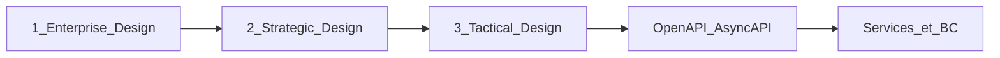

#### Phase 1 — Enterprise Design

**But.** Aligner la stratégie et les **capacités métier** avant de découper des services.

| Activité | Artefact | Outils |
|----------|----------|--------|
| Modèle économique / offre | Business Model Canvas | Miro, FigJam |
| Évolution des composants | Wardley Map | Onlinewardleymaps, Miro |
| Prioriser les capacités | Carte des business capabilities | Notion, atelier |

**Sortie.** Capacités stables et priorisées (ex. « Prise de commande », « Facturation », « Notification ») — candidates naturelles à des bounded contexts / services.

#### Phase 2 — Strategic Design

**But.** Faire émerger le **langage ubiquitaire**, les flux bout-en-bout et les **frontières** entre contextes.

| Activité | Artefact | Outils |
|----------|----------|--------|
| Raconter les parcours métier | Domain Storytelling | Atelier + sticky / Miro |
| Modéliser événements & commandes | EventStorming | Atelier (orange/blue/lila sticky) |
| Délimiter les contextes | Bounded contexts + **Context Map** | Context Mapper, Mermaid, draw.io |

**Sortie.** Context map (relations : *customer-supplier*, *conformist*, *ACL*, *OHS*…) et glossaire partagé. Chaque BC a un **owner** d’équipe.

#### Phase 3 — Tactical Design

**But.** Transformer chaque BC en **solution** et en **profil API** (sync + async), puis en spécifications.

| Activité | Artefact | Outils |
|----------|----------|--------|
| Profil du contexte | Bounded Context Canvas | Miro / template canvas |
| Vue communication | Architecture Communication Canvas | Atelier |
| Décisions structurantes | ADR | Markdown `docs/adr/` |
| Profil API haut niveau | **API Product Canvas** (valeur, fonctions, sync/async) | Atelier produit + archi |
| Contrats détaillés | **OpenAPI** / **AsyncAPI** | Stoplight, Swagger Editor ; GenAI possible à partir du canvas + glossaire |

**Sortie.** Pour chaque service : canvas + contrats versionnés. Les interactions **événementielles** du canvas deviennent topics/files (Kafka / RabbitMQ) ; les interactions **requête-réponse** deviennent REST/gRPC.

#### Lien avec ce dépôt

| Artefact Blueprint | Traduction projet12 |
|--------------------|---------------------|
| Bounded context | Service candidat (Orders, Billing, Notify…) |
| API Product Canvas (async) | Événements `order.created` → Kafka et/ou RabbitMQ |
| API Product Canvas (sync) | REST BFF / gateway si besoin |
| UI temps réel | Angular STOMP (RabbitMQ) ou WS → gateway Kafka |

#### Comment enchaîner (checklist atelier)

1. Capacités métier (Enterprise) validées avec le métier.  
2. EventStorming + Domain Storytelling → glossaire.  
3. Découper les BC ; dessiner la Context Map.  
4. Remplir un API Product Canvas **par** BC critique.  
5. Générer / écrire OpenAPI + AsyncAPI ; valider avec un parcours bout-en-bout.  
6. Assigner owner + DB logique par service ; noter les ADR (broker, sync/async).

### Outils / logiciels / frameworks

| Besoin | Outils |
|--------|--------|
| Enterprise Design | Business Model Canvas, Wardley Map |
| Modélisation domaine | Domain Storytelling, EventStorming, Context Mapper |
| Canvases Blueprint | Bounded Context Canvas, API Product Canvas, Architecture Communication Canvas |
| Contrats sync | **OpenAPI** 3.x (Swagger Editor, Stoplight, Redoc) |
| Contrats async | **AsyncAPI** |
| Diagrammes | Mermaid, draw.io, Structurizr (C4) |
| Décisions | ADR |

### Heuristiques de découpage (complément Blueprint)

- Cohésion métier forte / même capacité → même **bounded context** (phase 2)  
- Cycles de vie / scaling / équipes différents → services séparés  
- Éviter un service par table SQL (partir du canvas, pas du schéma)  
- Un BC = une équipe owner + une DB logique + des contrats sync/async explicites  

---

## 3. Styles de communication

### Objectif

Choisir, pour chaque interaction, **synchrone** (requête/réponse) ou **asynchrone** (événements / files).

### Livrables

- Matrice d’interactions service ↔ service (sync / async)
- Catalogue d’événements (nom, payload, producteur, consommateurs)
- Choix broker(s) et protocoles

### Quand utiliser quoi

| Pattern | Cas d’usage | Technologies typiques |
|---------|-------------|------------------------|
| REST / HTTP | CRUD, lectures, actions utilisateur | OpenAPI, NestJS, Spring, FastAPI, Express |
| gRPC | Appels internes haute perf, contrats stricts | Protobuf, gRPC Gateway |
| File de travail | Jobs, emails, PDF, retries | **RabbitMQ**, SQS, Redis queues |
| Event log / streaming | Historique, replay, pipelines | **Kafka**, Pulsar |
| UI temps réel | Navigateur live | RabbitMQ **STOMP/WebSocket**, ou gateway WS → Kafka |

### Lien avec ce dépôt

| Besoin UI / bus | Choix | Doc |
|-----------------|-------|-----|
| Angular ↔ broker direct (STOMP) | RabbitMQ | [COURS_RABBITMQ.md](COURS_RABBITMQ.md) |
| Angular ↔ Kafka | Gateway WebSocket (FastAPI) | [COURS_KAFKA.md](COURS_KAFKA.md) §5.3 |

### Outils

- Brokers : RabbitMQ, Apache Kafka (+ Docker Compose local)
- Clients : `amqp` / `@stomp/rx-stomp`, `kafka-python`, `confluent-kafka`, Spring AMQP / Kafka
- Documentation événements : AsyncAPI, schema registry (Avro/JSON Schema) si Kafka en prod

### Gestion des événements en cas de panne (serveur / réseau)

Les pannes ne sont pas l’exception : timeout réseau, broker indisponible, consumer crashé au milieu d’un traitement, partition réseau (*split-brain*). L’objectif n’est pas « zéro perte magique », mais une **politique explicite** : que se passe-t-il pour les événements *en transit*, *non ack*, *non publiés* ?

#### Scénarios de panne

| Scénario | Effet sur les événements | Risque |
|----------|--------------------------|--------|
| **Réseau producteur ↔ broker** | Publish échoue ou timeout | Perte si on ne retente / pas d’outbox |
| **Réseau consumer ↔ broker** | Pas d’*ack*, redelivery | Doublons → besoin d’**idempotence** |
| **Crash consumer après effet métier, avant ack** | Message rejoué | Double traitement |
| **Crash broker / disque** | Messages non persistés perdus | Perte si non durables / non répliqués |
| **Partition réseau (split)** | Clients parlent à un nœud isolé | Décisions incohérentes si mal configuré |
| **Backlog (consumer down longtemps)** | File / lag qui grossit | Saturation disque, SLA dépassés |
| **Poison message** | Crash en boucle sur le même msg | Blocage de la partition / file |

#### Sémantiques de livraison (à choisir consciemment)

| Sémantique | Garantie | Coût |
|------------|----------|------|
| **At-most-once** | Pas de doublon, possible perte | Simple ; OK si perte acceptable |
| **At-least-once** | Pas de perte (si persisté + retry), **doublons possibles** | Standard Kafka/RabbitMQ + **idempotence** |
| **Exactly-once** (effectif) | Effet métier une seule fois | Outbox + idempotence (+ transactions broker si dispo) ; jamais « gratuit » |

En pratique on vise **at-least-once + idempotence** (et outbox côté producteur).

#### Solutions à mettre en œuvre

**Côté producteur (publication)**

| Solution | Rôle |
|----------|------|
| **Transactional outbox** | Ne publier qu’après commit DB ; retry du publisher si le broker est down |
| **Confirms / acks broker** | RabbitMQ publisher confirms ; Kafka `acks=all` |
| **Retry avec backoff** | Réessais exponentiels + jitter ; circuit breaker si panne prolongée |
| **Fallback local** | Buffer disque / file locale si broker injoignable (avec alerte) |
| **Timeouts explicites** | Ne pas bloquer indéfiniment l’API utilisateur |

**Côté broker (durabilité & HA)**

| Solution | Kafka | RabbitMQ |
|----------|-------|----------|
| Persistance | Log + `replication.factor` ≥ 3 en prod | Queues/messages **durable** / **persistent** |
| Haute dispo | Cluster multi-brokers, min ISR | Cluster + **quorum queues** |
| Rétention | Garder assez longtemps pour rejouer après panne | TTL / DLX plutôt que rétention longue |
| Isolation | Quotas, disque monitoring | Limites longueur de file, alarmes depth |

**Côté consommateur (traitement)**

| Solution | Rôle |
|----------|------|
| **Ack manuel après succès** | N’*ack* qu’une fois l’effet métier + dédup commités |
| **Idempotence** | Table `processed_events` / upsert (voir §4) |
| **Nack / requeue limité** | Éviter boucle infinie ; compteur de tentatives |
| **Dead Letter Queue (DLQ) / dead letter topic** | Isoler les poison messages pour analyse |
| **Timeout + visibility** | Ne pas laisser un msg « invisible » trop longtemps sans heartbeat |
| **Graceful shutdown** | Finir le message en cours, puis stop (SIGTERM) |

**Côté plateforme / ops**

| Solution | Rôle |
|----------|------|
| Health `/ready` dépendant du broker | Ne plus recevoir de trafic si on ne peut plus publier/consommer |
| Alertes **lag** (Kafka) / **depth** (RabbitMQ) | Détecter panne consumer ou ralentissement |
| Runbook de reprise | Ordre : remonter broker → rejouer DLQ → vérifier idempotence |
| Chaos léger (staging) | Couper le réseau vers le broker pour valider les retries |

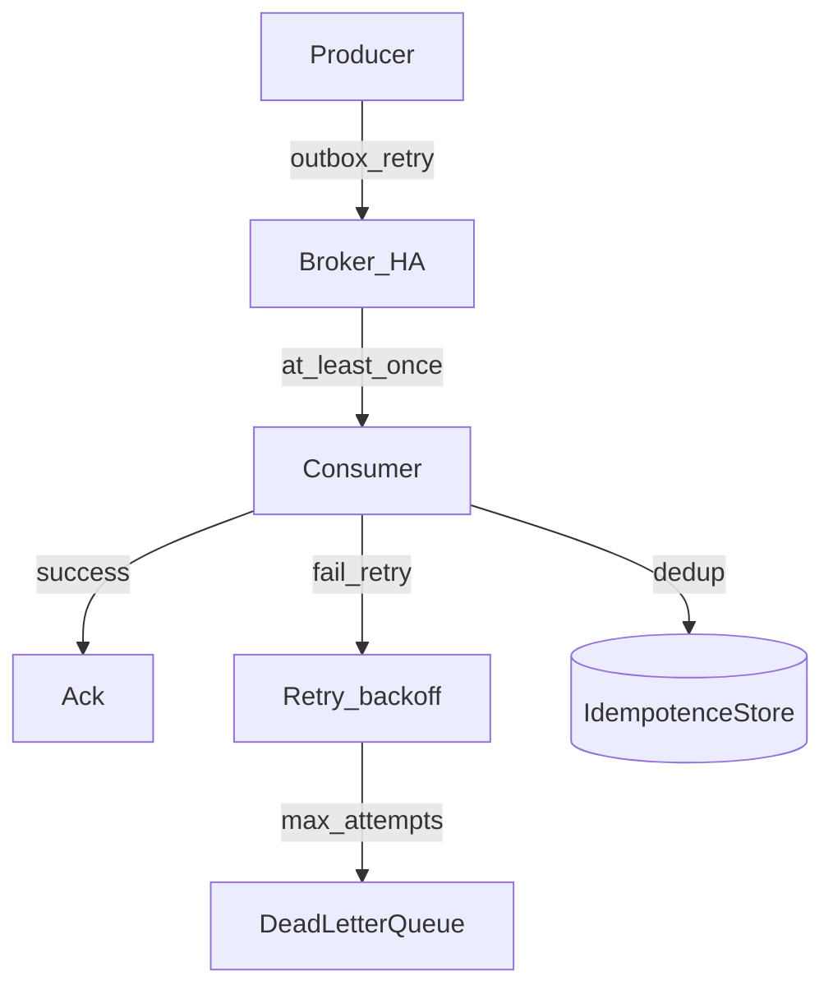

#### Matrice panne → réponse

| Panne | Réponse minimale |
|-------|------------------|
| Broker down au publish | Outbox + publisher en retry ; API peut répondre « accepté » si commit local OK |
| Consumer crash mid-process | Redelivery + idempotence |
| Réseau instable | Timeouts, retries bornés, circuit breaker |
| Message invalide / bug | DLQ + alerte ; pas de requeue aveugle |
| Consumer off 2 h | Capacité disque broker + alerte lag ; reprise avec débit limité (éviter thundering herd) |
| Perte d’un nœud broker | Réplication déjà en place ; bascule clients (bootstrap multi-brokers) |

#### Ce qu’il ne faut pas faire

- Fire-and-forget sans confirm ni outbox sur un parcours critique
- Auto-ack avant la fin du traitement métier
- Retry illimité sans DLQ
- Une seule instance broker non répliquée en production
- Ignorer le lag / la profondeur de file jusqu’au weekend

#### Livrables associés (conception)

- Politique de livraison (at-least-once + idempotence, etc.) par type d’événement
- Config durabilité / réplication broker
- Stratégie DLQ + runbook
- Seuils d’alerte lag/depth et tests de panne en staging

Lien avec la §4 (outbox, saga, idempotence) et la §9 (observabilité brokers).

---

## 4. Modèle de données et cohérence

### Objectif

Définir le stockage par service et la stratégie de cohérence (forte locale, éventuelle globale).

### Livrables

- Schéma de données par service
- Stratégie de migration
- Patterns de cohérence distribuée (outbox, saga, idempotence)
- Choix CQRS / réplicas / sharding selon le ratio lecture-écriture mesuré ou estimé

### Outils / logiciels / frameworks

| Besoin | Outils |
|--------|--------|
| SGBD relationnel | **PostgreSQL**, MySQL |
| Cache / sessions / locks légers | **Redis** |
| Search / projections lecture | Elasticsearch / OpenSearch, vues matérialisées |
| Réplicas lecture | Streaming replication PostgreSQL, read replicas cloud (RDS, Cloud SQL) |
| Sharding | Citus, Vitess, MongoDB sharding, sharding applicatif |
| Migrations Java | Flyway, Liquibase |
| Migrations Node | Prisma Migrate, Knex, TypeORM |
| Migrations Python | Alembic, Django migrations |
| Outbox / CDC | Debezium, transactional outbox maison |
| Projections CQRS | Kafka consumers, Redis, Elastic, DB de lecture dédiée |

### Principes

- Pas de base partagée « fourre-tout » entre microservices
- Transactions distribuées 2PC / XA à éviter en général
- Cohérence **forte en local** (dans un service), **éventuelle entre services** via événements

### Patterns de cohérence distribuée (détail)

Dans une appli répartie, un parcours métier traverse plusieurs services (commande → stock → paiement). On ne peut pas s’appuyer sur une seule transaction SQL globale. Les trois patterns ci-dessous se combinent presque toujours.

#### 1. Idempotence

**Problème.** Un message peut être livré **plus d’une fois** (retry réseau, *at-least-once* Kafka/RabbitMQ, republish). Sans précaution, on double-facture ou on décrémente le stock deux fois.

**Principe.** Traiter N fois le même message produit le **même effet métier** qu’une seule fois.

**Techniques concrètes**

| Technique | Description |
|-----------|-------------|
| **Clé d’idempotence** | ID métier stable (`order_id`, `payment_id`, header `Idempotency-Key`) |
| **Table de dédup** | Stocker les IDs déjà traités ; ignorer les doublons |
| **Upsert / état** | `INSERT … ON CONFLICT` ou machine d’états (`PENDING → PAID`) qui refuse les transitions invalides |
| **Versionnement optimiste** | Colonne `version` ; rejeter une mise à jour obsolète |

**Exemple.** Le service facturation reçoit `order.created` avec `order_id=ORD-42`. Avant de créer la facture, il cherche `ORD-42` dans `processed_events`. Si présent → *ack* sans retraiter. Sinon → créer la facture + enregistrer `ORD-42` **dans la même transaction locale**.

**Outils.** Stockage local (PostgreSQL), Redis (SET NX avec TTL pour dédup courte), libraries HTTP idempotentes côté API.

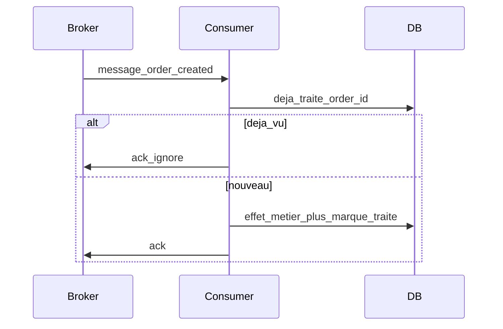

#### 2. Transactional outbox

**Problème.** Écrire en base **et** publier sur le broker ne sont pas atomiques. Si on commit la DB puis le broker tombe → événement perdu. Si on publie puis la DB rollback → événement fantôme.

**Principe.** Dans **la même transaction locale**, on écrit l’état métier **et** une ligne dans une table `outbox`. Un processus annexe publie ensuite vers Kafka/RabbitMQ, puis marque la ligne comme envoyée.

**Flux**

1. Service Commandes : `BEGIN` → insert `orders` → insert `outbox(event)` → `COMMIT`
2. Publisher / CDC lit `outbox` (polling ou Debezium)
3. Publish sur le broker
4. Marquer `outbox.published_at` (ou supprimer la ligne)

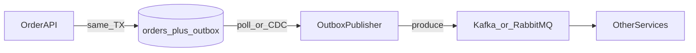

**Variantes**

| Variante | Outils / approche |
|----------|-------------------|
| **Polling outbox** | Worker périodique (`SELECT … FOR UPDATE SKIP LOCKED`) |
| **CDC** | **Debezium** lit le WAL PostgreSQL / binlog MySQL → Kafka |
| **Inbox** (côté conso) | Table miroir pour garantir idempotence à la réception |

**Outils.** PostgreSQL, Debezium, Kafka Connect, libs « transactional outbox » (ex. frameworks Spring / custom FastAPI+SQLAlchemy).

#### 3. Saga

**Problème.** Un workflow multi-services doit réussir **globalement** ou se **compenser** : réserver stock, débiter carte, confirmer commande — sans 2PC.

**Principe.** Enchaîner des **transactions locales** + messages. En cas d’échec d’une étape, exécuter des **actions de compensation** (annuler réservation, rembourser).

**Deux styles**

| Style | Qui orchestre | Avantages | Inconvénients |
|-------|---------------|-----------|---------------|
| **Orchestration** | Un *saga orchestrator* envoie des commandes aux participants | Flux lisible, centralisé | Point de coordination à fiabiliser |
| **Chorégraphie** | Chaque service réagit aux événements des autres | Moins de couplage central | Plus dur à suivre / debugger |

**Exemple (orchestration) — commande**

1. Orchestrator → Stock : `ReserveItems` → OK  
2. Orchestrator → Paiement : `ChargeCard` → **échec**  
3. Orchestrator → Stock : `ReleaseItems` (compensation)  
4. Orchestrator → Commandes : `MarkFailed`

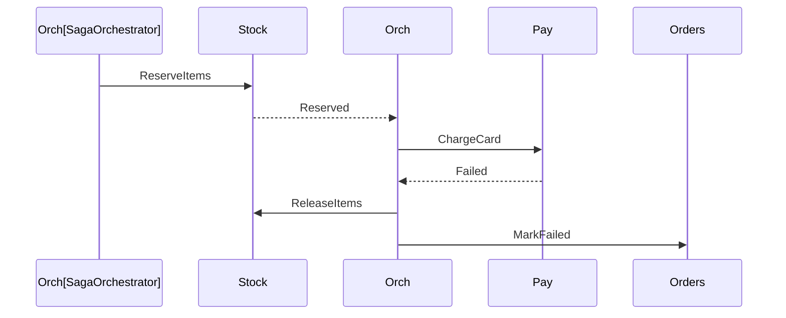

**Bonnes pratiques saga**

- Chaque étape **idempotente** (rejeu de `ReserveItems` sans double réservation)
- Compensations aussi idempotentes
- Timeout + état de saga persisté (`saga_instances`)
- Éviter les compensations impossibles (préférer réservation temporaire + confirm)

**Outils.** Orchestrateurs : Temporal, Camunda, Netflix Conductor, ou orchestrateur maison + outbox. Chorégraphie : Kafka/RabbitMQ + machines d’états par service.

#### Comment les combiner

| Pattern | Rôle |
|---------|------|
| **Outbox** | Garantir qu’un événement est publié **s’il** y a eu commit local |
| **Idempotence** | Garantir qu’un événement (re)consommé n’applique l’effet qu’**une** fois |
| **Saga** | Coordonner **plusieurs** commits locaux + compensations sur un parcours métier |

Enchaînement typique : *API Commandes* commit order+outbox → *publisher* envoie `order.created` → *Stock* et *Paiement* consomment de façon idempotente → en cas d’échec paiement, *saga* déclenche compensations via de nouveaux messages (eux aussi outbox + idempotents).

#### Ce qu’il ne faut pas faire

- Compter sur « le broker ne livre jamais en double »
- Publier l’événement **avant** le commit DB sans outbox
- Saga sans compensations ni timeouts
- Partager une base pour « faire une grosse transaction » entre services

### CQRS, scalabilité des bases et ratio lecture/écriture

Après la cohérence inter-services, il faut dimensionner **comment** chaque service stocke et sert les données : un modèle CRUD unique suffit souvent au début ; au-delà, **CQRS**, **réplicas** et **sharding** répondent à des profils lecture/écriture différents.

#### CQRS (Command Query Responsibility Segregation)

**Principe.** Séparer le modèle d’**écriture** (commands : créer, modifier, supprimer) du modèle de **lecture** (queries : listes, recherches, dashboards).

| Côté | Rôle | Stockage typique |
|------|------|------------------|
| **Command** | Valider règles métier, persister l’état de vérité | PostgreSQL (write model) |
| **Query** | Répondre vite aux lectures, éventuellement dénormalisé | Redis, Elasticsearch, vue matérialisée, DB read-only |

**Lien event-driven.** Après un commit (+ outbox), un événement alimente des **projections** de lecture (consommateur Kafka/RabbitMQ qui met à jour le read model). La lecture peut être **éventuellement cohérente** (léger délai après l’écriture).

**Quand l’adopter**

| Situation | Approche |
|-----------|----------|
| CRUD simple, peu de lectures complexes | Un seul modèle suffit |
| Écrans de lecture très différents de l’écriture, fort trafic read | CQRS utile |
| Recherche full-text / agrégats lourds | Read model dédié (souvent Elastic) |
| Équipe encore petite, domaine simple | Éviter la complexité CQRS trop tôt |

**Outils.** Write : PostgreSQL. Read : Redis, Elasticsearch/OpenSearch, réplicas SQL, vues matérialisées. Pipeline : Kafka / Debezium / consumers de projection.

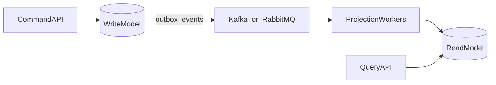

#### Scalabilité lecture vs écriture

| Besoin | Leviers | Limites |
|--------|---------|---------|
| **Scale lecture** | Réplicas read-only, cache (CDN/Redis), CQRS / projections, pagination | Réplica en retard (*replication lag*) → données un peu stale |
| **Scale écriture** | Vertical (plus gros nœud), partitionnement, **sharding** horizontal | Transactions **cross-shard** difficiles ; rebalancing coûteux |

**Sharding (écriture).** On découpe les données en **shards** selon une clé (`tenant_id`, `user_id`, hash). Chaque shard a son primary (et éventuellement des réplicas).

- Choisir une clé qui évite les hotspots (pas une date seule si tout le trafic du jour tombe sur un shard)
- Les jointures et transactions multi-shards sont à éviter ou à gérer en applicatif (saga)
- Outils : **Citus** (PostgreSQL), **Vitess** (MySQL), sharding MongoDB, ou routage applicatif

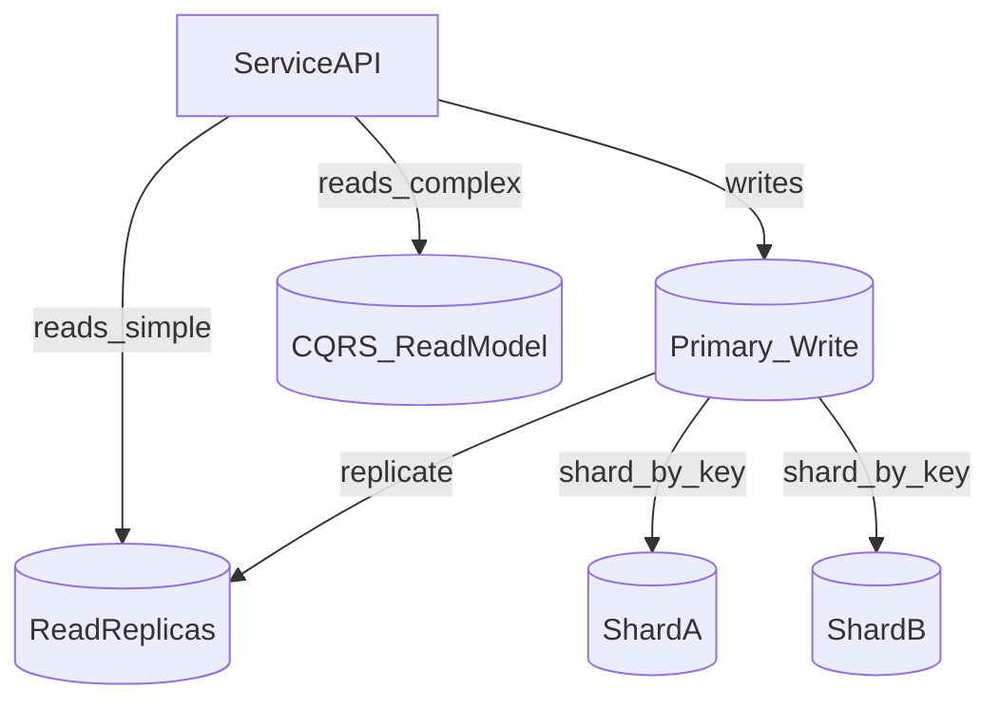

> En pratique on combine souvent : **primary (+ shards si write-heavy)** pour les commands, **réplicas + cache + read model** pour les queries.

#### Ratio écriture / lecture (W:R)

Le ratio **écritures : lectures** guide le design. Ce sont des **ordres de grandeur indicatifs** : toujours **mesurer** (APM, `pg_stat_statements`, QPS cloud, logs).

| Type d’application | Ratio approx. W:R | Orientation architecture données |
|--------------------|-------------------|----------------------------------|
| CRUD admin interne | ~1:1 à **1:5** | DB unique souvent suffisante |
| E-commerce (catalogue, fiches produit) | ~1:10 à **1:100** | Cache, réplicas, parfois CQRS catalogue |
| Réseau social / feed | ~1:100 à **1:1000+** | Fort bias lecture : CDN, cache, read models |
| IoT / télémétrie / clickstream | **10:1 à 100:1** (write-heavy) | Sharding écriture, batch, Kafka → warehouse |
| Banking / ledger | Variable ; writes critiques | Cohérence forte sur write ; lectures contrôlées / auditées |
| Analytics / BI | Lectures massives (souvent batch) | OLAP / data warehouse séparé (pas la DB OLTP) |
| SaaS multi-tenant (API mixte) | Souvent **1:5 à 1:50** | Réplicas + isolation par `tenant_id` (parfois shard) |

**Comment utiliser le ratio**

1. Estimer ou mesurer W et R sur les parcours critiques  
2. Si **read-heavy** → réplicas, cache, CQRS avant de shard-er  
3. Si **write-heavy** → capacité write, partitioning/sharding, file d’ingestion (Kafka)  
4. Si **les deux** explosent → CQRS + shards sur le write model + projections scalées indépendamment  

**Mesure.** Prometheus/exporters DB, slow query logs, tracing OpenTelemetry sur repository, métriques broker (si l’écriture passe d’abord par Kafka).

#### Théorèmes CAP et PACELC

Ces modèles aident à **justifier** les choix DB (mono-primary, réplicas, CQRS, stores AP) selon le type d’application — pas à coller une étiquette marketing sur un produit.

##### CAP

En présence d’un système **distribué** qui stocke des copies de données :

| Lettre | Signification |
|--------|----------------|
| **C** Consistency | Tous les nœuds voient la **même** donnée à un instant donné (lecture après écriture cohérente) |
| **A** Availability | Chaque requête reçoit une réponse (succès/erreur métier), même si des nœuds sont isolés |
| **P** Partition tolerance | Le système continue malgré une **coupure réseau** entre nœuds |

**Point clé.** Sur un réseau réel, **P est inévitable**. En cas de **partition**, on ne peut pas garantir à la fois C et A : il faut trancher **CP** ou **AP**.

| Orientation | Comportement en partition | Exemples d’esprit |
|-------------|---------------------------|-------------------|
| **CP** | Refuser certaines requêtes pour ne pas servir de donnée fausse | PostgreSQL primary (écritures sur un leader), etcd, ZooKeeper |
| **AP** | Continuer à répondre, éventuellement avec donnée **stale** | Cassandra, DynamoDB (selon config), caches multi-région |

Hors partition, beaucoup de systèmes offrent C et A ensemble ; le théorème CAP parle surtout du **moment où le réseau casse**.

##### PACELC

CAP ne dit rien du comportement **sans** partition. **PACELC** complète :

> Si **P**artition → choisir **A** ou **C** ; **E**lse (fonctionnement normal) → choisir **L**atency ou **C**ohérence.

| Formule | En partition | Hors partition | Sens pratique |
|---------|--------------|----------------|---------------|
| **PC/EC** | Préfère C | Préfère C | Forte cohérence ; latence OK si besoin d’attendre le quorum/leader |
| **PC/EL** | Préfère C | Préfère Latence | Rare / hybride : strict en panne, rapide au calme (configs fines) |
| **PA/EC** | Préfère A | Préfère C | Dispo en panne ; cohérence forte quand le réseau est sain |
| **PA/EL** | Préfère A | Préfère Latence | Dispo + lectures rapides ; cohérence **éventuelle** (réplicas, caches) |

**Lien avec réplicas / CQRS / sharding**

- Lire sur un **réplica** (lag) = souvent trade **L** vs **C** (PACELC « EL »)
- **CQRS** read model = lectures AP/EL possibles pendant que le write model reste plus C
- **Sharding** ne résout pas CAP : chaque shard a encore ses propres trade-offs

##### CAP / PACELC selon le type d’application

| Type d’application | Orientation typique | Implication données |
|--------------------|---------------------|---------------------|
| CRUD admin interne | **PC/EC** | Mono-DB PostgreSQL souvent suffisante |
| E-commerce **catalogue** (lecture) | **PA/EL** | Cache, réplicas, parfois CQRS ; stale bref acceptable |
| E-commerce **paiement / stock critique** | **PC/EC** (ou PA/EC contrôlé) | Write sur primary ; pas de lecture stale pour le débit carte |
| Réseau social / feed | **PA/EL** | CDN, cache, read models ; cohérence éventuelle |
| IoT / télémétrie (ingestion) | **PA/EL** | Accepter buffer/Kafka ; traiter async ; pas bloquer les capteurs |
| Banking / ledger | **PC/EC** | Forte cohérence write ; lectures auditées ; latence négociée |
| Analytics / BI | Plutôt hors chemin OLTP | Warehouse ; cohérence « à un instant T » batch, pas CAP temps réel |
| SaaS multi-tenant mixte | **Hybride** | PC/EC sur billing ; PA/EL sur dashboards / recherche |

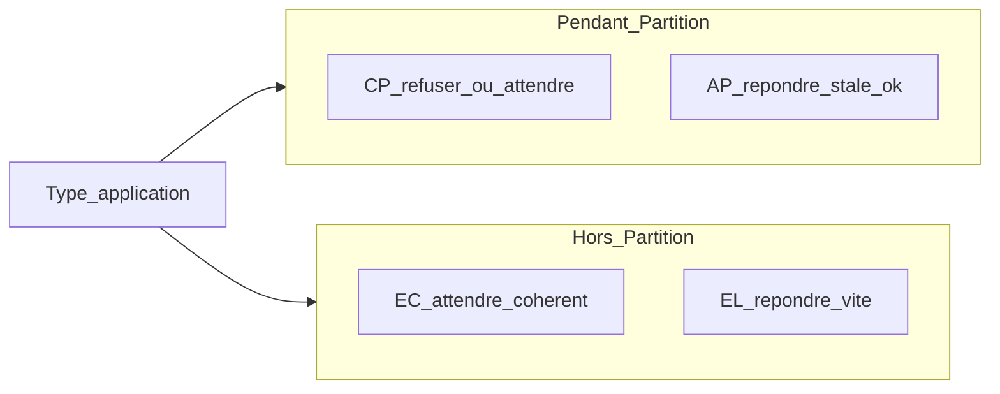

**Méthode de choix**

1. Classer chaque **parcours** (pas toute l’app d’un bloc) : paiement ≠ page catalogue.  
2. En partition : perte de **dispo** acceptable ? → sinon AP. Donnée fausse inacceptable ? → CP.  
3. Hors partition : faut-il la dernière écriture immédiatement ? → EC ; sinon réplicas/cache → EL.  
4. Documenter le choix en **ADR** (ex. « catalogue PA/EL, checkout PC/EC »).

---

## 5. API, edge et front

### Objectif

Exposer un bord système stable (clients web/mobile) tout en isolant les services internes.

### Livrables

- Choix API Gateway / reverse proxy
- BFF (Backend For Frontend) si besoin Angular
- Cartographie des routes publiques vs internes

### Outils / logiciels / frameworks

| Couche | Options concrètes |
|--------|-------------------|
| Front | **Angular** (ce dépôt), React, Vue |
| BFF / API | NestJS, Spring Boot, **FastAPI**, .NET |
| Gateway / proxy | Kong, Traefik, NGINX, Envoy |
| Dev local multi-services | **Docker Compose**, Tilt, Skaffold |

### Patterns utiles

- BFF Angular : agrège plusieurs appels backend, gère auth cookie/token
- Gateway : TLS, rate limiting, routage, cors
- Ne pas exposer tous les microservices directement sur Internet

---

## 6. Sécurité

### Objectif

Authentifier / autoriser, protéger les secrets et les communications.

### Livrables

- Modèle d’identité (utilisateurs, services, machine-to-machine)
- Politique de secrets et de rotation
- Exigences TLS, CORS, headers de sécurité

### Outils / logiciels / frameworks

| Besoin | Outils |
|--------|--------|
| Identité (OIDC/OAuth2) | **Keycloak**, Auth0, Cognito, Azure AD |
| Secrets | HashiCorp **Vault**, Doppler, secrets CI/CD / cloud KMS |
| Certificats | Let’s Encrypt, cert-manager (K8s) |
| Scan dépendances | npm audit, Dependabot, Snyk, Trivy (images) |
| Brokers | utilisateurs / vhosts RabbitMQ ; SASL/TLS Kafka (prod) |

### Principes

- `guest`/`guest` **uniquement** en local (comme dans la démo RabbitMQ)
- Moindre privilège entre services (mTLS ou tokens courts)
- Ne jamais committer `.env` contenant des secrets

---

## 7. Architecture cible et documentation

### Objectif

Figer une vue partageable de l’architecture et des décisions.

### Livrables

- Diagrammes C4 (contexte, conteneurs, composants)
- Diagrammes de séquence des parcours critiques
- ADR pour les choix majeurs (broker, DB, gateway, auth)
- Inventaire des services + owners

### Outils / logiciels / frameworks

| Besoin | Outils |
|--------|--------|
| C4 / architecture as code | **Structurizr**, IcePanel |
| Diagrammes légers | **Mermaid** (dans le repo), draw.io, Excalidraw |
| Séquences | Mermaid `sequenceDiagram`, PlantUML |
| Décisions | ADR Markdown |

Exemple de vue cible (alignée sur ce dépôt pédagogique) :

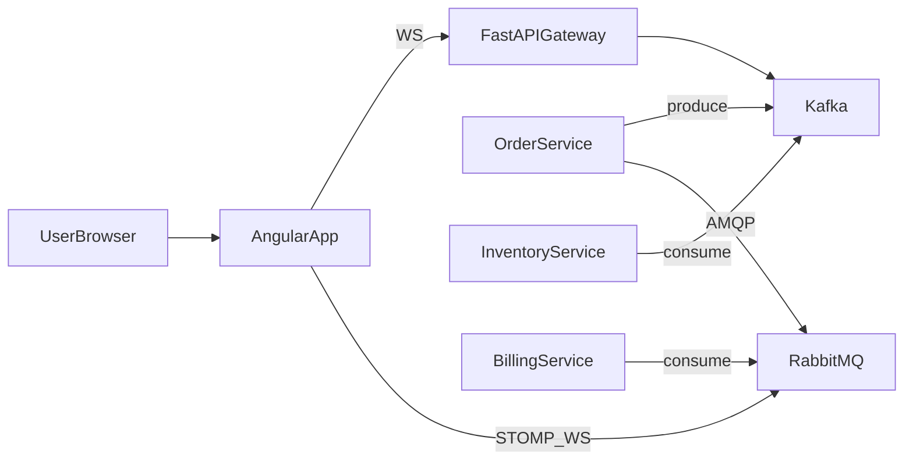

---

# Partie B — Livraison

## 8. Livraison continue (CI/CD)

### Objectif

Construire, tester, empaqueter et déployer de façon **répétable** vers plusieurs environnements.

### Livrables

- Pipeline CI (PR) et CD (deploy)
- Images / artefacts versionnés
- Environnements : local → staging → prod
- Stratégie de migration DB et de rollback

### Outils / logiciels / frameworks

| Étape | Outils |
|-------|--------|
| SCM | **Git** + GitHub / GitLab / Bitbucket |
| CI | **GitHub Actions**, GitLab CI, Jenkins, Azure DevOps |
| Qualité | ESLint, Prettier, Ruff/Black, SonarQube ; tests Jest/JUnit/pytest |
| Conteneurs | **Docker**, BuildKit, multi-stage builds |
| Registry | GHCR, Docker Hub, ECR, GCR, Harbor |
| Orchestration (prod) | Kubernetes, Nomad ; en plus simple : Docker Compose / Swarm |
| Infra as code | **Terraform**, Pulumi, Crossplane ; Ansible |
| Config & flags | env par environnement, LaunchDarkly / Unleash (feature flags) |
| Déploiement progressif | blue-green, canary (Argo Rollouts, Flagger) |

### Pipeline type

1. Checkout → install dépendances  
2. Lint + tests unitaires / contrats (OpenAPI, Pact)  
3. Build image Docker → push registry  
4. Deploy staging → smoke tests  
5. Approbation → deploy prod  
6. Migrations contrôlées (expand/contract)

### Local (ce dépôt)

```bash
docker compose up -d --build   # brokers + gateway
cd frontend && npm start       # Angular
```

---

# Partie C — Contrôle en fonctionnement

## 9. Observabilité et exploitation

### Objectif

Savoir si le système est sain, où ça casse, et alerter avant l’impact utilisateur.

### Livrables

- Healthchecks par service
- Dashboards (latence, erreurs, saturation, lag files/topics)
- Alertes avec runbooks
- Corrélation logs ↔ traces ↔ métriques

### Les trois piliers (+ alertes)

| Pilier | Objectif | Outils |
|--------|----------|--------|
| **Logs** | Comprendre un incident | ELK (Elasticsearch/Logstash/Kibana), **Grafana Loki** + Promtail, CloudWatch |
| **Métriques** | Tendances, SLO | **Prometheus** + **Grafana**, Datadog, New Relic |
| **Traces** | Suivre une requête cross-services | **OpenTelemetry**, Jaeger, Tempo, Zipkin |
| **Alertes** | Réaction humaine | Alertmanager, PagerDuty, Opsgenie, Slack |

### Contrôles spécifiques message brokers

| Signal | Kafka | RabbitMQ |
|--------|-------|----------|
| Retard traitement | Consumer group **lag** | Queue **depth** / unacked |
| Santé broker | Under-replicated partitions | Node / disk alarms (Management) |
| UI admin | Confluent Control Center / AKHQ / Redpanda Console | Management UI `:15672` |

### Health & readiness

- Endpoints `/health` (liveness) et `/ready` (dépendance DB/broker OK)
- Exemple déjà présent : gateway Kafka `GET /health` (`localhost:8000/health`)

### SLO / SLA utiles

- Disponibilité (ex. 99.9 %)
- Latence p95 des API critiques
- Taux d’erreur 5xx
- Lag max acceptable sur topics / profondeur max des files

---

## 10. Coût d’exploitation et dimensionnement

### Objectif

Estimer le **coût d’infra** (et donc d’exploitation) en fonction des **choix architecturaux** et de la **charge utilisateurs**, avant de figer multi-région, Kafka cluster, CQRS, etc.

> Les chiffres ci-dessous sont des **ordres de grandeur pédagogiques** (vCPU, Go RAM, nœuds). Ce ne sont **pas** un devis AWS/GCP/Azure. Toujours recalibrer avec un POC + metrics.

### Ce qui fait monter le coût

| Leviers | Effet typique sur le coût |
|---------|---------------------------|
| Nombre de microservices | + instances, + observabilité, + pipelines |
| Broker | RabbitMQ 1–3 nœuds ≪ Kafka cluster ≥ 3 brokers (+ disque log) |
| DB | Primary + **N réplicas** lecture + shards |
| Multi-région | ≈ **×2 à ×3** compute/stockage/réseau (réplication croisée) |
| CQRS / search | + workers projection + Elastic/Redis |
| Observabilité (logs/métriques/traces) | souvent **+20–40 %** du compute app |
| HA stricte (99.99 %) | redondance multi-AZ / multi-région obligatoire |

### Hypothèses de charge (conversion rapide)

| Notion | Définition utile |
|--------|------------------|
| **MAU** | Utilisateurs actifs / mois |
| **Concurrent** | Sessions simultanées en pic (~1–5 % des DAU selon le produit) |
| **RPS** | Requêtes / seconde au pic |

Règle empirique très grossière :  
`RPS_pic ≈ concurrent × actions_par_seconde` (souvent 0,1–1 action/s/user actif).  
Exemple : 500 users concurrents × 0,2 req/s ≈ **100 RPS**.

### Profils de dimensionnement (une région, app métier type e-commerce / SaaS)

Hypothèses communes : API + workers, PostgreSQL, un broker, front Angular servi via CDN (coût front quasi négligeable hors build).

| Profil | Users (ordre) | Concurrent pic | RPS pic (ordre) | App (instances) | DB | Broker | Régions / réplication |
|--------|---------------|----------------|-----------------|-----------------|-----|--------|------------------------|
| **S — Petit** | ~1k MAU | ~20–50 | ~10–30 | 2 × (1–2 vCPU, 2–4 Go) | 1 primary (2–4 vCPU, 8–16 Go) ; 0 réplica | RabbitMQ **1** nœud (1–2 vCPU, 2–4 Go) ou Kafka single (dev) | **1** région, 1 AZ min ; réplication DB = 0 |
| **M — Moyen** | ~50k MAU | ~200–800 | ~100–400 | 4–8 × (2 vCPU, 4 Go) | Primary (4–8 vCPU, 32 Go) + **1–2** read replicas | RabbitMQ **3** quorum *ou* Kafka **3** brokers (4 vCPU, 8–16 Go, disque SSD) | **1** région, **multi-AZ** ; réplication facteur **3** (broker) |
| **L — Large** | ~500k MAU | ~2k–8k | ~1k–5k | 20–60 × (2–4 vCPU, 4–8 Go) + autoscaling | Primary + **3–5** replicas ; shards si write-heavy | Kafka **≥3–6** brokers ; éventuellement cluster dédié | **1–2** régions ; si 2 régions ≈ **×2** nœuds + bande passante réplication |

**Réseau (indicatif)**

| Profil | Sortie / entrée typique | Commentaire |
|--------|-------------------------|-------------|
| S | < 50 Mbps pic | Surtout API JSON |
| M | 100–500 Mbps pic | + images/CDN, événements |
| L | 1–10 Gbps agrégé | Multi-AZ/région : compter le **trafic de réplication** DB/broker (souvent du même ordre que le trafic utile) |

### Lien choix architecturaux → surcoût

| Choix | Surcoût relatif (vs base mono-région simple) | Détail infra |
|-------|-----------------------------------------------|--------------|
| Monolithe + 1 PostgreSQL + RabbitMQ 1 nœud | **1×** (référence S) | Peu de nœuds, ops simple |
| Microservices (5–10) sans autoscaling agressif | **1,5–2,5×** | Plus d’instances idle + observabilité |
| Réplicas lecture + cache Redis | **+20–50 %** DB/cache | Utile si W:R élevé (catalogue, feed) |
| CQRS + Elastic | **+30–80 %** | Index + workers projection |
| Kafka cluster 3 brokers vs RabbitMQ 3 | **+50–150 %** côté messaging | Disque log, JVM, ops Kafka |
| Multi-AZ (même région) | **+30–60 %** | Réplicas / quorum |
| Multi-région actif-passif | **≈ ×2** | Standby + réplication async |
| Multi-région actif-actif | **≈ ×2–3** + complexité | Conflict resolution, latency réseau |
| Orientation **PC/EC** (forte cohérence) | Coût en **latence** plus qu’en $ | Moins de caches stale ; parfois plus de primary puissant |
| Orientation **PA/EL** | Plus de **réplicas/cache** | $ lecture ↑, UX plus rapide |

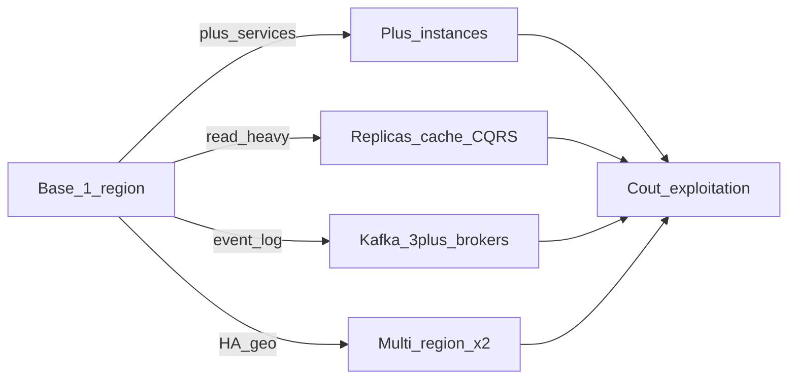

### Exemples chiffrés synthétiques (1 région, hors CDN)

| Scénario | vCPU app (approx.) | RAM app | DB vCPU / RAM | Broker nœuds | Facteur réplication |
|----------|--------------------|---------|---------------|--------------|---------------------|
| 1k users, CRUD | 2–4 | 4–8 Go | 2–4 / 8–16 Go | 1 | ×1 |
| 50k users, e-commerce | 8–16 | 16–32 Go | 8–16 / 32–64 Go + 1–2 replicas | 3 | ×3 (AZ) |
| 500k users, feed + events | 40–120 | 80–240 Go | 16–32+ / 64–256 Go + replicas/shards | 3–6 Kafka | ×3 local ; ×2 si 2 régions |

**Marge ops :** ajouter **+20–40 %** vCPU/RAM pour Prometheus/Loki/OTel, bastion, CI runners, staging (souvent 30–50 % de la prod).

### Méthode d’estimation (à suivre dans un ADR « capacity »)

1. Estimer **MAU → concurrent → RPS pic** (et taille moyenne des messages/payloads).  
2. Sizer **app** (RPS / capacité d’une instance) → nb instances × 2 (HA).  
3. Sizer **DB** selon W:R (réplicas si read-heavy ; shards si write-heavy).  
4. Sizer **broker** (RabbitMQ vs Kafka) + facteur de réplication (≥ 3 en prod).  
5. Multiplier par **nb régions** (actif-passif ≈ ×2 stockage/compute standby).  
6. Ajouter **observabilité + staging** (+20–40 %).  
7. Revoir après **load test** (k6, Locust, Gatling).

### Effectif pour le suivi (debug, sécurité, infra)

Le coût d’exploitation n’est pas que de l’infra : il faut des **personnes** pour debugger, sécuriser et faire tourner la plateforme. Les chiffres ci-dessous sont des **ordres de grandeur en ETP** (équivalent temps plein), pas un organigramme RH. Ils varient fortement avec l’automatisation (CI/CD, IaC, autoscaling) et l’astreinte 24/7.

| Profil | Taille (rappel) | Debug / support applicatif | Sécurité (AppSec, IAM, vulns) | Infra / plateforme (SRE, cloud, DB, brokers) | Total indicatif |
|--------|-----------------|----------------------------|-------------------------------|-----------------------------------------------|-----------------|
| **S — Petit** | ~1k MAU | **0,5–1** ETP (devs qui assurent le run) | **0,1–0,3** ETP (souvent mutualisé / externe ponctuel) | **0,2–0,5** ETP (souvent le même dev + cloud managé) | **≈ 1–2** ETP |
| **M — Moyen** | ~50k MAU | **1–2** ETP (astreinte partagée entre 2–4 devs) | **0,5–1** ETP (AppSec + revues, secrets, dependabot) | **1–2** ETP (SRE / DevOps : K8s ou VM, DB, broker, observabilité) | **≈ 3–5** ETP |
| **L — Large** | ~500k MAU | **3–6** ETP (équipe support L2/L3 + on-call) | **1–3** ETP (AppSec, IAM, pentest, conformité) | **3–8** ETP (plateforme, DBAs/SRE data, messaging, multi-région) | **≈ 8–15+** ETP |

**Périmètre des rôles**

| Rôle | Activités typiques |
|------|-------------------|
| **Debug / suivi applicatif** | Incidents métier, logs/traces, correctifs hot, lag consumers, DLQ, qualité des releases |
| **Sécurité** | OIDC/IAM, secrets, scans dépendances/images, revues, réponse incident sécu, hardening brokers/DB |
| **Infra / plateforme** | Cloud, Kubernetes/VM, PostgreSQL/réplicas, Kafka/RabbitMQ, monitoring, backup, capacity, FinOps |

**Notes de lecture**

- En **S**, une même personne cumule souvent debug + infra ; la sécu est un **pourcentage** de temps ou un prestataire.
- En **M**, séparer clairement **plateforme** et **devs produit** évite le monolithe humain.
- En **L**, l’astreinte **24/7** impose un **pool** (souvent 4–8 personnes en rotation pour un service critique), donc plus d’ETP que le « run diurne ».
- Multi-région, Kafka large, conformité (PCI, santé, finance) → **hausse nette** du besoin sécu + infra.
- Bien automatiser (CI/CD, IaC, alertes actionnables) peut **réduire 20–40 %** l’effectif run à taille égale.

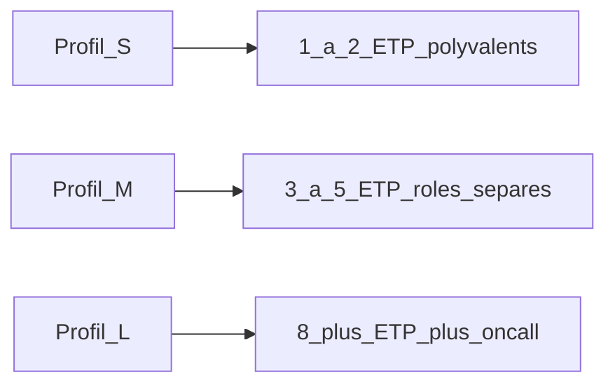

### Livrables

- Feuille de capacity planning (RPS, nœuds, vCPU, RAM, disque, régions)
- Comparatif de coût de 2–3 options archi (ex. RabbitMQ mono-région vs Kafka multi-AZ)
- Décision multi-région **justifiée** par RTO/RPO, pas par défaut
- Estimation d’**effectif run** (debug / sécu / infra) alignée sur le profil S/M/L et le niveau d’astreinte

---

## 11. Analyse des SPOF et mitigations

### Objectif

Identifier les **points de défaillance uniques** (*Single Points of Failure*, SPOF) — composants dont la panne **seule** interrompt un parcours critique — et proposer des **mitigations** réalistes (coût vs RTO/RPO).

### Définition

Un SPOF n’est pas « tout ce qui peut tomber ». C’est un élément **sans alternative immédiate** sur un chemin critique : si ce nœud, cette AZ, ce broker ou ce compte de service disparaît, le parcours métier s’arrête.

### Méthode d’analyse

1. **Inventorier** les composants (API, BFF, gateway, DB, broker, IdP, DNS, LB, registry, CI).  
2. Pour chaque **parcours critique** (login, paiement, publication d’événement…), tracer le chemin.  
3. Marquer tout composant **non redondé** sur ce chemin comme SPOF candidat.  
4. Noter **criticité** (RTO/RPO acceptables) et **probabilité**.  
5. Choisir une **mitigation** (redondance, failover, dégradation gracieuse) et documenter en ADR.  
6. Rejouer l’analyse après chaque changement d’archi majeur.

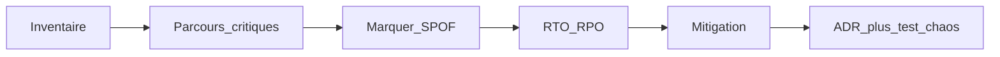

### SPOF typiques et mitigations

| SPOF | Symptôme si panne | Mitigation |
|------|-------------------|------------|
| **1 instance API / BFF / gateway** | 502 / timeout total | ≥ 2 instances derrière un **load balancer** + healthchecks `/ready` |
| **1 primary DB sans failover** | Écritures impossibles | Multi-AZ standby / failover auto ; backups testés ; réplicas lecture ≠ HA write |
| **1 nœud broker** (Kafka ou RabbitMQ) | Plus de messaging | Cluster ; Kafka `replication.factor` ≥ 3 ; RabbitMQ **quorum queues** ; bootstrap multi-brokers |
| **1 availability zone** | Tout tombe avec l’AZ | Déployer **multi-AZ** (app, DB, broker) |
| **1 région cloud** | Sinistre régional | Actif-passif ou actif-actif (coût §10) ; RTO/RPO explicites |
| **IdP / auth unique sans HA** | Plus de login | IdP redondé (Keycloak cluster / SaaS multi-région) ; cache tokens court terme |
| **Secrets sur une seule machine** | Déploiements / run bloqués | Vault / KMS HA ; pas de secret uniquement local |
| **DNS / LB / certificat unique mal géré** | Service injoignable | DNS géré + health ; LB managé multi-AZ ; renouvellement auto (cert-manager) |
| **Registry d’images unique** | Impossible de redéployer | Mirror / registry secondaire ; images déjà présentes sur les nœuds |
| **1 consumer / 1 file non HA** | Backlog, parcours async mort | Plusieurs consumers ; files durables ; alerte lag/depth ; DLQ |
| **Gateway Kafka unique (ce dépôt en démo)** | UI Kafka coupée | Plusieurs replicas gateway ; ou HA côté broker + sticky sessions WS |

### Mitigations génériques (checklist technique)

| Levier | Pratique |
|--------|----------|
| **Redondance** | N+1 ou N+2 instances ; pas d’état critique sur une seule VM |
| **Multi-AZ** | Obligatoire dès le profil M pour les composants critiques |
| **Quorum / réplication** | Brokers et métadonnées avec majorité ; éviter « 2 nœuds » sans arbiter |
| **Failover DB** | Automatisé + **exercé** (game day) ; RPO mesuré |
| **Dégradation gracieuse** | Lecture seule, file d’attente, message « réessayez » plutôt que crash total |
| **Health + LB** | Retirer du pool les instances non prêtes |
| **Idempotence + outbox** | Survivre aux retries après bascule (lien §3 et §4) |
| **Runbooks + alertes** | Savoir qui fait quoi quand le SPOF restant tombe quand même |

### Lien avec le reste de la procédure

| Section | Rapport aux SPOF |
|---------|------------------|
| §3 Pannes événements | SPOF broker / consumer → HA + DLQ + idempotence |
| §4 CAP / réplicas | Failover CP vs lectures AP ; réplica ≠ suppression du SPOF write |
| §9 Observabilité | Détecter le SPOF avant les users (health, lag, disque) |
| §10 Coût | Chaque mitigation a un prix (×2 multi-région, +nœuds, +ETP) |

### Ce qu’il ne faut pas faire

- Croire qu’un **réplica en lecture** protège des écritures (le primary reste SPOF write)
- Cluster à **2 nœuds** sans quorum clair (indisponibilité ou split-brain)
- Multi-région « pour la brochure » sans RTO/RPO ni test de bascule
- Un seul environnement prod sans moyen de redéployer si le registry est down

### Livrables

- Matrice **parcours critique × composants × SPOF × mitigation × RTO**
- ADR pour chaque mitigation coûteuse (multi-région, cluster Kafka, etc.)
- Au moins un **test de bascule** documenté (staging) par SPOF critique

---

## 12. Analyse 7D et risques projet

### Objectif

Passer le projet au crible de **7 dimensions de risque** (analyse **7D**), puis lister les **risques particuliers** de *ce* dépôt pédagogique avant toute projection en production.

### Méthode 7D

Pour chaque dimension : identifier les risques, estimer **probabilité × impact**, définir un **propriétaire** et une **mitigation** (renvoi aux sections de cette procédure).

| # | Dimension | Risques typiques | Questions de contrôle | Mitigation (renvoi) |
|---|-----------|------------------|----------------------|---------------------|
| **D1** | Métier / fonctionnel | Mauvais découpage, parcours critiques flous, scope creep | Les parcours critiques sont-ils listés avec NFR ? | §1 cadrage, user stories, ADR |
| **D2** | Technique / architecture | Mauvais choix sync/async, chatty services, dette tech | Kafka vs RabbitMQ est-il justifié par parcours ? | §2–§3, §5, §7 C4 |
| **D3** | Données / cohérence | Doublons, perte d’événements, base partagée | Outbox / saga / idempotence prévus ? CAP documenté ? | §4 |
| **D4** | Sécurité | Secrets en clair, guest/guest, surface STOMP/WS | Auth OIDC, TLS, scans dépendances ? | §6 |
| **D5** | Organisation / compétences | Manque d’ETP run, confusion brokers, bus factor 1 | Effectif debug/sécu/infra suffisant ? | §10 effectif |
| **D6** | Coût / délais / capacity | Sous-dimensionnement, multi-région « gratuit » | Capacity S/M/L et budget validés ? | §10 dimensionnement |
| **D7** | Exploitation / disponibilité | SPOF, pas d’alerte lag, pas de runbook | Matrice SPOF + bascule testée ? | §3 pannes, §9, §11 |

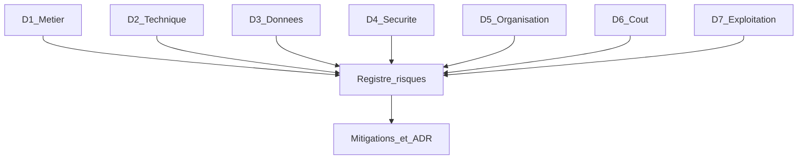

**Échelle simple (P × I)** : Faible / Moyen / Élevé — traiter en priorité tout risque **Élevé** sur D3, D4 ou D7 pour un système événementiel.

### Risques particuliers de ce projet (projet12)

Contexte : dépôt **pédagogique** — Angular + RabbitMQ STOMP + Kafka via gateway FastAPI + Docker Compose local. Les risques ci-dessous ciblent surtout une **mauvaise industrialisation** de la démo.

| ID | Risque | Dim. | P | I | Mitigation |
|----|--------|------|---|---|------------|
| R1 | Copier la démo **mono-nœud** (Kafka/RabbitMQ) en prod → SPOF broker | D2, D7 | M | E | Cluster, RF≥3 / quorum queues ; ne pas promouvoir Compose démo tel quel (§11, §10) |
| R2 | Identifiants **guest/guest** et ports exposés hors localhost | D4 | E | E | Comptes dédiés, TLS, réseau privé ; jamais guest en prod (§6) |
| R3 | **Gateway Kafka** unique = SPOF pour l’UI WebSocket | D2, D7 | M | E | Plusieurs replicas gateway + LB ; health `/ready` (§11, `gateway/`) |
| R4 | Absence de **contrats** AsyncAPI / Schema Registry → breaking changes silencieux | D2, D3 | M | M | AsyncAPI + schémas versionnés dès le premier service métier (§2–§3) |
| R5 | Confusion **Kafka vs RabbitMQ** (même UI à onglets) → mauvais broker en prod | D2, D5 | M | M | ADR « catalogue → RabbitMQ / event-log → Kafka » ; formation (§3, cours) |
| R6 | STOMP Angular sans auth forte en local pris pour un modèle prod | D4 | M | E | OIDC + WSS ; pas d’exposition publique du port 15674 (§5–§6) |
| R7 | Sous-estimation **coût / ETP** si on ajoute multi-région et Kafka HA « comme dans le cours » | D5, D6 | M | M | Feuille capacity + effectif S/M/L avant go-live (§10) |
| R8 | Pas d’**observabilité** brokers (lag/depth) hors Management UI manuelle | D7 | M | M | Prometheus + alertes lag/depth ; runbooks (§9) |

### Matrice de priorisation (ce projet)

| | Impact Moyen | Impact Élevé |
|--|--------------|--------------|
| **Prob. Élevée** | — | **R2** (secrets guest) |
| **Prob. Moyenne** | R4, R5, R7, R8 | **R1**, **R3**, **R6** |
| **Prob. Faible** | (à compléter en atelier) | — |

**Traitement immédiat recommandé pour industrialiser :** R2 → R1/R3/R6 → R8 → R4/R5/R7.

### Livrables

- Registre 7D (une ligne par risque : dimension, P, I, owner, mitigation, échéance)
- Liste des risques **spécifiques projet** revue à chaque jalon (MVP, staging, prod)
- ADR pour tout risque Élevé accepté (risque résiduel assumé)

---

# Clôture

## Checklist de validation d’architecture

- [ ] NFR documentés et testables  
- [ ] Services avec responsabilités claires + owners  
- [ ] Contrats OpenAPI / AsyncAPI versionnés  
- [ ] Sync vs async justifié par parcours  
- [ ] Politique panne événements (outbox, ack, DLQ, réplication, alertes lag/depth)  
- [ ] Une DB logique par service + stratégie de cohérence  
- [ ] Ratio W/R estimé ou mesuré → réplicas / CQRS / sharding justifiés  
- [ ] CAP/PACELC par parcours critique (CP vs AP, EC vs EL) documenté en ADR  
- [ ] Edge (gateway/BFF) + auth OIDC  
- [ ] Diagrammes C4 + ADR des choix majeurs  
- [ ] Pipeline CI/CD + rollback  
- [ ] Logs, métriques, traces, alertes + runbooks  
- [ ] Monitoring brokers (lag / profondeur de file)  
- [ ] Capacity / coût d’exploitation estimé (nœuds, vCPU, RAM, régions, réplication)  
- [ ] Effectif run estimé (debug, sécurité, infra) selon taille et astreinte  
- [ ] Matrice SPOF + mitigations + test de bascule sur les parcours critiques  
- [ ] Analyse **7D** + registre des risques particuliers du projet à jour

## Anti-patterns à éviter

| Anti-pattern | Problème | Piste |
|--------------|----------|--------|
| **Monolithe distribué** | Couplage fort + complexité réseau | Revoir bounded contexts |
| **Chatty services** | Latence / fragilité | Agrégation BFF, événements |
| **Bus fourre-tout** | Topics/files sans propriétaire | Catalogue d’événements + ownership |
| **Base partagée** | Couplage schéma | DB par service + intégration async |
| **Pas d’idempotence** | Doublons après retry | Clés métier + dédup |
| **Pas de plan panne événements** | Pertes ou boucles | Outbox, DLQ, HA broker, alertes |
| **SPOF non analysé** | Panne totale sur un nœud | Matrice SPOF + redondance multi-AZ |
| **Pas d’analyse 7D** | Risques oubliés (orga, coût, sécu) | Registre 7D + revue projet |
| **Observabilité après coup** | Blind flight en prod | OTel dès le premier service |

## Synthèse outils par phase

| Phase | Outils phares |
|-------|----------------|
| Cadrage | Miro, Notion, ADR |
| Découpage | Synergetic Blueprint, EventStorming, OpenAPI, AsyncAPI |
| Communication | REST/gRPC, RabbitMQ, Kafka |
| Données | PostgreSQL, Redis, outbox, CQRS/réplicas/sharding |
| Edge / front | Angular, Nest/FastAPI/Spring, Kong/Traefik |
| Sécurité | Keycloak, Vault, TLS |
| Cible | C4, Mermaid, Structurizr |
| Livraison | Git, GitHub Actions, Docker, Terraform/K8s |
| Runtime | Prometheus, Grafana, Loki, OpenTelemetry, alertes |
| Coût / capacity | RPS, vCPU/RAM, réplicas, régions, effectif run (ETP) |
| Résilience | Matrice SPOF, multi-AZ, quorum brokers, failover DB |
| Risques | Analyse 7D, registre P×I, risques spécifiques projet |

---

## Résumé

1. Concevoir dans l’ordre : cadrage → services → communication → données → edge → sécurité → docs.  
2. Choisir sync/async et le broker selon le besoin (voir cours Kafka / RabbitMQ) ; prévoir pannes (outbox, at-least-once + idempotence, DLQ, HA).  
3. Données : outbox/saga/idempotence ; ratio W/R (réplicas, CQRS, sharding) ; arbitrages **CAP/PACELC** selon le type de parcours.  
4. Livrer via CI/CD conteneurisé et environnements séparés.  
5. Contrôler en production avec logs, métriques, traces, healthchecks et alertes — y compris lag / profondeur des brokers.  
6. Estimer le **coût d’exploitation** (instances, DB, broker, régions, réplication) **et l’effectif** (debug / sécu / infra) selon la taille ; recalibrer par load test.  
7. Analyser les **SPOF** par parcours critique et mitiger (redondance, multi-AZ, quorum, failover) en lien avec le budget et le RTO.  
8. Conduire une **analyse 7D** et traiter les **risques particuliers du projet** (ex. démo ≠ prod : guest, mono-nœud, gateway SPOF).
