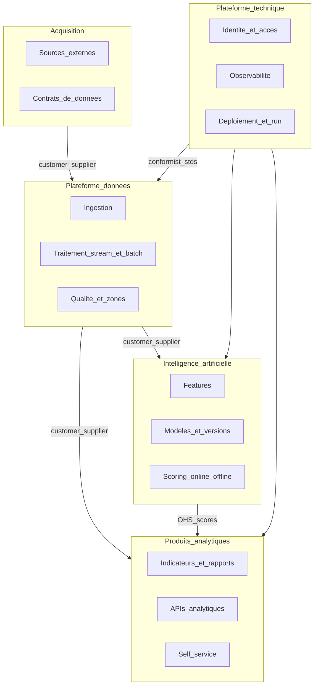
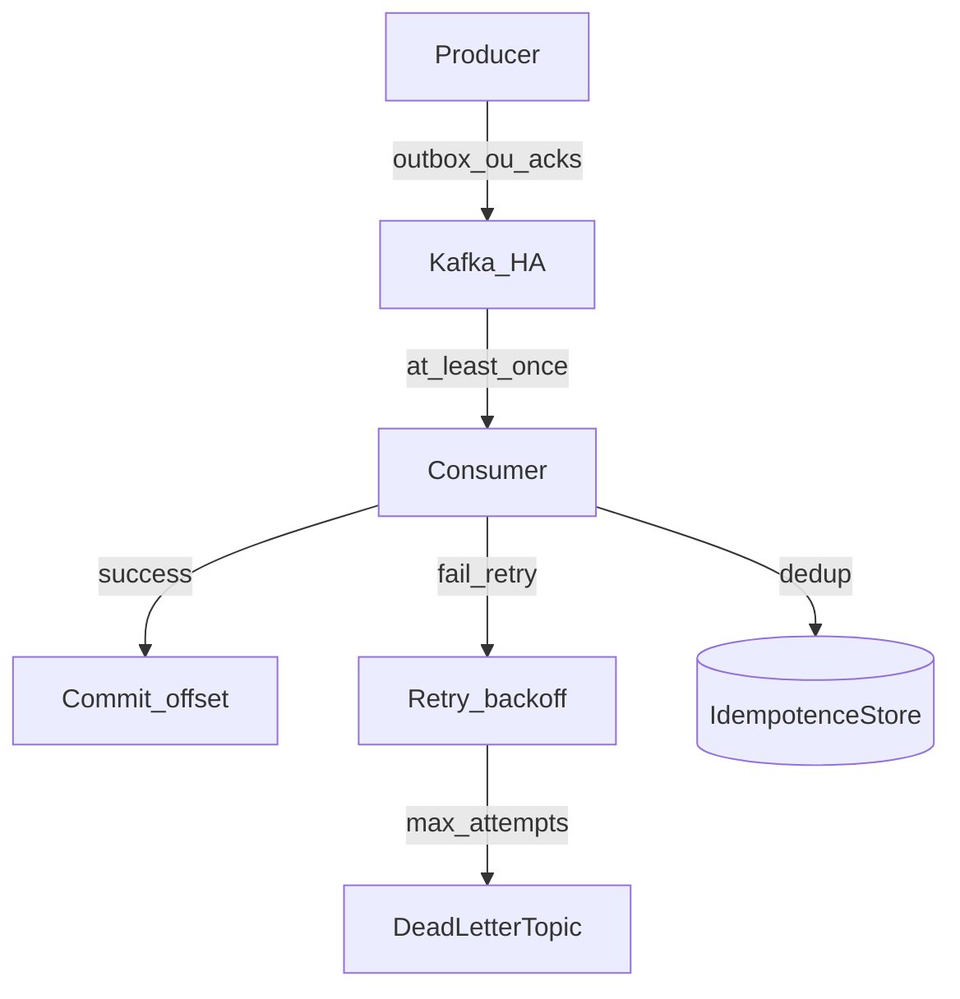
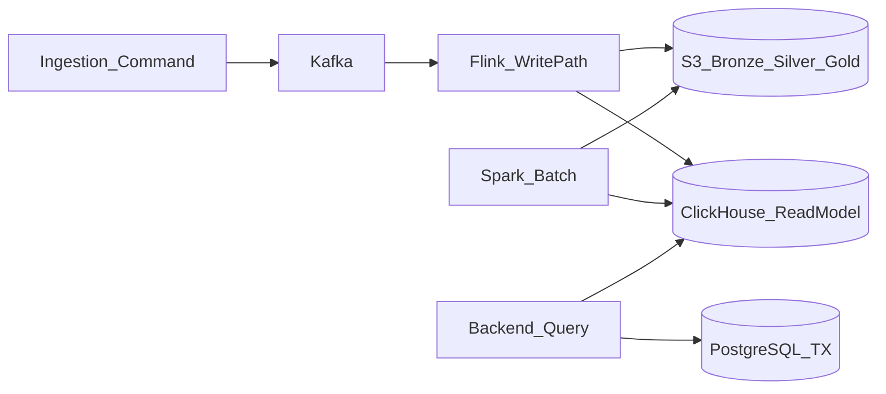
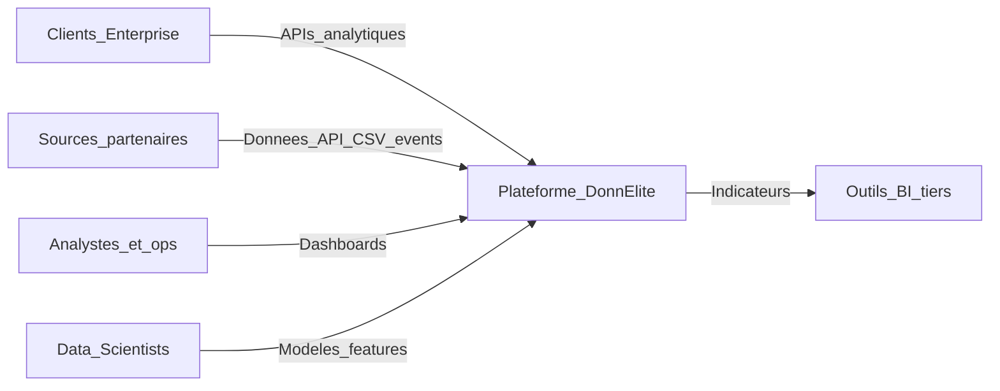
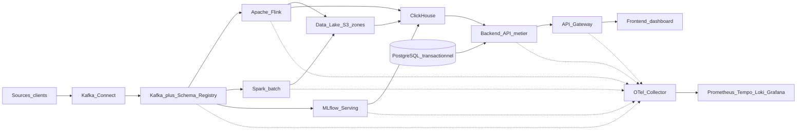
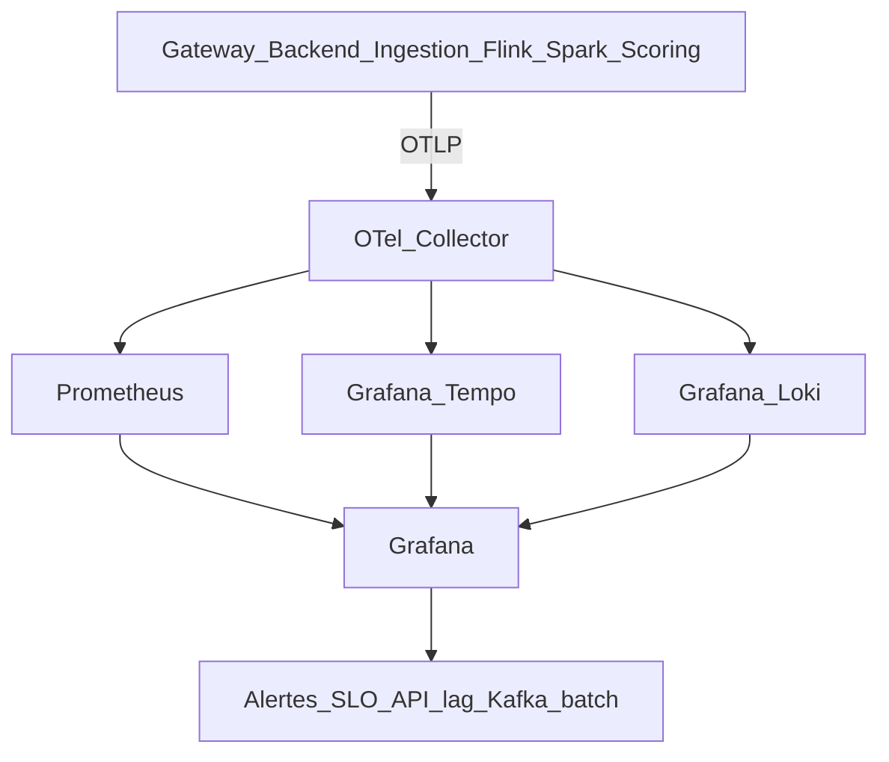
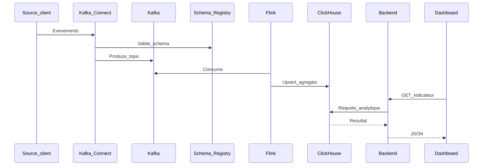

# Définition d’architecture du système cible — DonnÉlite

**Version :** 1.0  
**Auteur :** Architecte logiciel — DonnÉlite  
**Destinataire :** Karyma, Head of Engineering  
**Date :** août 2026  
**Méthode :** [PROCEDURE_ARCHITECTURE_REPARTIE.md](PROCEDURE_ARCHITECTURE_REPARTIE.md) (Partie A §1–§7 + contrôles §10–§12)  
**Sources :** [contexte metier.md](contexte%20metier.md), [incident.md](incident.md), [papport technique architecture.md](papport%20technique%20architecture.md)  
**Périmètre CDC :** définition d’architecture uniquement (hors rapport d’audit et dossier d’intégration)

---

## 0. Objet, principes et hypothèses

Ce document formalise l’architecture cible du SI DonnÉlite pour répondre aux enjeux de montée en charge, fiabilité et évolutivité. Il couvre :

- la modélisation du domaine métier ;
- la description de l’architecture cible ;
- un benchmark de solutions techniques ;
- la justification des choix retenus ;
- les interactions entre composants (existants et nouveaux) ;
- les critères d’acceptation.

### Principes directeurs

1. **Strangler fig** — migration progressive ; pas de big-bang.
2. **Réutilisation** — Kafka, Spark, S3, API Gateway, backend, frontend conservés et recentrés.
3. **Event-driven gouverné** — nouveaux flux via Kafka + contrats de schémas ; fin progressive des contournements REST data.
4. **Lambda pragmatique** — stream (Flink) pour la fraîcheur ; batch (Spark) pour backfills et jobs lourds.
5. **Maîtrise des coûts cloud** et **sobriété numérique** (réduction duplication ~30 %, rétention, TTL).

### Hypothèses de conception

1. Les équipes peuvent monter en compétence Flink / ClickHouse / OpenTelemetry avec spike + formation.
2. Le cluster Kafka peut être dimensionné pour devenir le bus data canonique.
3. Une partie des indicateurs Enterprise tolère ~5 minutes de latence (retour Produit : stabilité > streaming total fragile).
4. PostgreSQL reste pertinent pour le transactionnel / métadonnées, pas pour le serving analytique massif.
5. Les services Node.js et Python s’instrumentent via SDK OpenTelemetry sans réécriture majeure.
6. La plateforme doit rester disponible pendant la transition (contrainte opérationnelle).

### Besoins d’évolution synthétisés (starter kit)

| ID | Besoin | Origine |
|----|--------|---------|
| B1 | Indicateurs quasi temps réel (minutes, pas heures) | CU1, incidents, Direction produit |
| B2 | Intégration sources sans refonte d’architecture | CU2, historique REST ad hoc |
| B3 | Déploiement fréquent / versionné des modèles IA | CU3, feedback Data Scientists |
| B4 | SLA Enterprise 99,9 %, latence API stable | CU4, clients, incident #245 |
| B5 | Self-service analytics sur données gouvernées | CU5 |
| B6 | Cohérence dashboard ↔ API | Client, incident #312 / réunion |
| B7 | Observabilité ≥ 95 % des services | SRE, taux ~60 % aujourd’hui |
| B8 | Maîtrise coûts + réduction duplication / rétention | Finance, note écologique |

---

## 1. Cadrage métier et exigences (§1 procédure)

### 1.1 Vision / périmètre

| In | Out (ce document) |
|----|-------------------|
| Architecture cible, composants, interactions, NFR, ADR | Rapport d’audit complet |
| Benchmark et justifications | Dossier d’intégration / onboarding |
| Capacity / SPOF / risques 7D (design) | Pipelines CI/CD détaillés |

### 1.2 Acteurs et personas

| Acteur | Besoin principal |
|--------|------------------|
| Analyste métier | Indicateurs frais, self-service |
| Responsable opérationnel | Alertes critiques, dashboards stables |
| Data Scientist | Déployer / versionner des modèles sans coller au brut lake |
| Application tierce | API analytiques SLA 99,9 %, latence prévisible |
| Client Enterprise | Isolation, traçabilité, fraîcheur ≤ 5 min acceptable |
| Data Engineering / SRE | Pipelines maintenables, monitoring, déploiements homogènes |

### 1.3 Parcours critiques

1. **Ingestion → indicateur dashboard/API** (quasi temps réel).
2. **Lecture API analytique Enterprise** (SLA / latence).
3. **Batch nocturne résiduel** (backfill, corrections).
4. **Scoring prédictif** (nouvelle version de modèle).
5. **Alerte sur événement critique**.

### 1.4 NFR chiffrés

| NFR | Cible | Contexte actuel (ordre de grandeur) |
|-----|-------|-------------------------------------|
| Disponibilité API analytiques | ≥ 99,9 % mensuel | Incidents SLA Enterprise |
| Latence API analytique p95 | ≤ 500 ms | 4–7 s aux pics |
| Fraîcheur indicateurs prioritaires | ≤ 5 min (p95) événement → dispo | Plusieurs heures |
| Volume ingestion | Dimensionner pour ~18 To/j +12 %/mois | Rapport technique |
| Durée batch résiduel | ≤ 4 h | ~9 h 15 |
| Couverture monitoring | ≥ 95 % services critiques | ~60 % |
| Duplication inutile | ≤ 10 % | ~30 % |
| RTO bascule critique | ≤ 15 min | Non formalisé |
| RPO bus / serving | ≤ 5 min sur parcours temps réel | Variable |

---

## 2. Découpage en services — DDD light (§2 procédure)

### 2.1 Capacités métier (Enterprise Design)

| Capacité | Priorité | Bounded context candidat |
|----------|----------|--------------------------|
| Acquisition de sources | Haute | Acquisition |
| Ingestion & contrats de données | Haute | Plateforme données |
| Traitement stream / batch | Haute | Plateforme données |
| Indicateurs & APIs analytiques | Haute | Produits analytiques |
| Self-service / exploration | Moyenne | Produits analytiques |
| Features & scoring IA | Haute | Intelligence artificielle |
| Identité, obs, run | Haute | Plateforme technique |

### 2.2 Bounded contexts et context map

| Context | Responsabilité | Owner |
|---------|----------------|-------|
| Acquisition | Connecter sources, valider schémas, provenance | Data Engineering |
| Plateforme données | Ingestion, stream/batch, zones bronze/silver/gold | Data Engineering |
| Produits analytiques | Indicateurs, API, dashboards, self-service | Produit + Backend |
| IA | Features, registry modèles, scoring | Data Science / ML Eng. |
| Plateforme technique | Auth, observabilité, CI/CD, isolation tenants | Engineering / SRE |

### 2.3 Concepts du langage ubiquitaire

| Concept | Définition |
|---------|------------|
| Source | Origine (API partenaire, CSV, app métier, événement) |
| Événement | Fait métier horodaté sur le bus |
| Dataset de zone | Bronze (brut), Silver (nettoyé), Gold (servable) |
| Indicateur | Agrégat métier exposé dashboard / API |
| Modèle | Artefact versionné produisant un score |
| Contrat de données | Schéma + compatibilité + propriétaire |

### 2.4 Services candidats et contrats

| Service | BC | Sync | Async | DB logique |
|---------|-----|------|-------|------------|
| Connecteurs / Ingestion | Acquisition | Admin API | Produce Kafka | Métadonnées connecteurs |
| Stream processor (Flink) | Plateforme données | Ops API | Consume/produce Kafka | État Flink |
| Batch ETL (Spark) | Plateforme données | Jobs API | Consume Kafka / lake | Métadonnées jobs |
| Serving analytique (ClickHouse) | Produits | SQL via Backend | Inserts depuis Flink/Spark | ClickHouse |
| Backend API métier | Produits | REST | Consume événements métier | PostgreSQL TX |
| Scoring + MLflow | IA | Serving HTTP | Consume features Kafka | Registry + features |
| Gateway / Auth / Obs | Plateforme tech | HTTP / OTLP | — | Secrets / IdP |

**Règle :** une base logique par service — plus de PostgreSQL analytique partagé entre backend, batch et scoring.

### 2.5 Couverture des cas d’usage

| CU | Besoin | Réponse architecturale |
|----|--------|------------------------|
| CU1 | Quasi temps réel | Flink sur Kafka → Silver/Gold + ClickHouse + alertes |
| CU2 | Sources simplifiées | Kafka Connect + Schema Registry |
| CU3 | Modèles fréquents | MLflow + serving découplé du brut |
| CU4 | Enterprise | ClickHouse, isolation, SLA, traçabilité |
| CU5 | Self-service | Couche Gold gouvernée + BI sur ClickHouse |

---

## 3. Styles de communication (§3 procédure)

### 3.1 Matrice sync / async

| De → Vers | Mode | Justification |
|-----------|------|---------------|
| Client / Front → Gateway → Backend | Sync REST | UX, CRUD, lectures indicateurs |
| Backend → ClickHouse | Sync SQL | Lectures analytiques basse latence |
| Sources → Kafka Connect → Kafka | Async | Découplage, replay, scale ingestion |
| Kafka → Flink / Spark / Scoring | Async | Pipelines, at-least-once |
| Backend → autres services data (historique REST) | À migrer async | Contournements à éliminer |
| Services → OTel Collector | Async OTLP | Observabilité non bloquante |

### 3.2 Catalogue d’événements (extrait)

| Événement | Producteur | Consommateurs | Sémantique |
|-----------|------------|---------------|------------|
| `source.record.ingested` | Connect / Ingestion | Flink, lake bronze | At-least-once |
| `indicator.aggregate.updated` | Flink | ClickHouse loader, alertes | At-least-once + idempotence |
| `feature.vector.ready` | Feature pipeline | Scoring | At-least-once + idempotence |
| `model.score.emitted` | Scoring | ClickHouse, Backend | At-least-once |
| `pipeline.batch.failed` | Spark | Alerting / DLQ ops | At-least-once |

### 3.3 Politique de panne (événements)

| Élément | Choix |
|---------|-------|
| Livraison | **At-least-once** + **idempotence** consommateur |
| Producteur | Confirms / `acks=all` ; **outbox** si commit DB + publish |
| Broker | Cluster Kafka, `replication.factor` ≥ 3, monitoring lag |
| Échec traitement | Retry borné + **DLQ** / dead letter topic |
| Poison message | Isolation DLQ + alerte ; pas de requeue aveugle |

---

## 4. Modèle de données et cohérence (§4 procédure)

### 4.1 Stockage par responsabilité

| Store | Rôle | Orientation CAP / PACELC |
|-------|------|--------------------------|
| PostgreSQL | État applicatif, métadonnées, users, configs | **PC/EC** sur writes |
| Kafka | Log d’événements, replay | Durabilité RF≥3 ; lag géré |
| S3 medallion | Bronze / Silver / Gold + TTL | Stockage objet ; cohérence éventuelle lecture |
| ClickHouse | Read model analytique | **PA/EL** acceptable (stale ≤ quelques minutes) |
| Redis (optionnel) | Cache sessions / agrégats chauds | PA/EL |
| MLflow store | Versions modèles | PC/EC sur registry |

### 4.2 Medallion + CQRS léger

- **Write path :** événements + transformations Flink/Spark.  
- **Read path :** ClickHouse (analytique) + PostgreSQL (transactionnel).  
- **Cohérence globale :** éventuelle entre services ; forte en local (transaction service).

### 4.3 Patterns de cohérence distribuée

| Pattern | Usage DonnÉlite |
|---------|-----------------|
| Idempotence | Upserts ClickHouse / tables `processed_events` sur consumers |
| Transactional outbox | Backend métier si publication Kafka après commit PG |
| Saga | Réservé aux workflows multi-étapes critiques (ex. onboarding source) ; chorégraphie Kafka préférée sinon |

### 4.4 Ratio W:R et leviers

Profil dominant : **ingestion write-heavy** (~18 To/j) + **API/dashboards read-heavy**.

| Zone | Ratio approx. | Leviers |
|------|---------------|---------|
| Ingestion / Kafka | Write-heavy | Partitionnement topics, Connect scale-out |
| API analytique | Read-heavy | ClickHouse, cache, pas de PG analytique |
| Scoring | Mixte | Features pré-calculées, serving dédié |

---

## 5. API, edge et front (§5 procédure)

| Couche | Choix cible |
|--------|-------------|
| Front | Frontend dashboard **conservé** |
| Edge | **API Gateway** : TLS, auth, rate limiting Enterprise, injection `traceparent` |
| BFF / API | Backend applicatif **évolué** : lit ClickHouse (analytique) + PostgreSQL (TX) |
| Interne | Services data **non exposés** directement sur Internet |

**Routes publiques :** `/api/*` via Gateway.  
**Routes internes :** Kafka, Flink, Spark, ClickHouse admin, MLflow — réseau privé / VPC.

---

## 6. Sécurité (§6 procédure)

| Domaine | Mesure cible |
|---------|--------------|
| Identité | Auth interne **évoluée** vers OIDC (Keycloak ou IdP existant HA) ; scopes API par tenant |
| Isolation Enterprise | Quotas Gateway + filtrage `tenant_id` / projet sur requêtes ClickHouse |
| Secrets | Vault / KMS ; jamais secrets en clair dans images ou scripts Docker ad hoc |
| Transport | TLS edge ; TLS/SASL Kafka en prod |
| Brokers | Comptes dédiés (pas `guest`) ; ACLs topics |
| Supply chain | Scan images (Trivy) + dépendances |

---

## 7. Architecture cible (§7 procédure)

### 7.1 C4 — Contexte

### 7.2 C4 — Conteneurs

### 7.3 Inventaire : conservés, évolués, nouveaux

| Composant | Statut | Rôle cible |
|-----------|--------|------------|
| Frontend dashboard | Conservé | UI ; API stables |
| API Gateway | Conservé | Entrée, auth, rate limit, `traceparent` |
| Backend API métier | Évolué | Métier + lecture **ClickHouse** ; PG = TX / métadonnées |
| Service ingestion RT | Évolué | Producteur Kafka standardisé (schémas) |
| Kafka | Évolué / généralisé | Bus unique nouveaux flux |
| **Schema Registry** | **Nouveau** | Contrats Avro / JSON Schema |
| **Kafka Connect** | **Nouveau** | Connecteurs sources (CDC, fichiers, HTTP) |
| ETL Spark batch | Conservé (réduit) | Jobs lourds, repros, backfills |
| **Apache Flink** | **Nouveau** | Quasi temps réel, alertes |
| Data Lake S3 | Évolué | Zones + TTL |
| PostgreSQL | Évolué (réduit) | Plus de serving analytique massif |
| **ClickHouse** | **Nouveau** | Serving analytique basse latence |
| Service scoring | Évolué | Features / topics ; modèles via MLflow |
| **MLflow** | **Nouveau** | Registry + déploiement versionné |
| Auth interne | Évolué | Isolation tenants / scopes |
| **OTel Collector** | **Nouveau** | Collecte OTLP |
| **Prometheus / Tempo / Loki / Grafana** | **Nouveau** | Métriques, traces, logs, alertes |

### 7.4 Patterns architecturaux

1. Event-driven progressif (strangler fig).  
2. Lambda pragmatique (Flink + Spark).  
3. Medallion (bronze / silver / gold).  
4. CQRS léger (écriture événements / lecture ClickHouse).  
5. Contrat-first data (Schema Registry obligatoire en prod).  
6. Observabilité by design (OTel dès les nouveaux services).

### 7.5 Flux cibles

**Quasi temps réel (CU1) :** Sources → Connect / ingestion → Kafka → Flink → Silver/Gold et/ou ClickHouse → API / alertes / dashboard.

**Batch maîtrisé :** Kafka ou bronze → Spark → silver/gold → ClickHouse. Objectif batch **≤ 4 h**.

**Scoring (CU3) :** Features (topics / Gold) → MLflow Serving / scoring → Kafka et/ou ClickHouse. Plus de dépendance principale au brut non contractuel.

**Lecture Enterprise (CU4) :** Gateway → Backend → ClickHouse + PostgreSQL TX ; isolation tenant + quotas.

**Observabilité :**

Propagation : W3C Trace Context HTTP ; `traceparent` dans headers Kafka ; logs JSON avec `trace_id`.

---

## 8. Benchmark de solutions techniques

### 8.1 Serving analytique (saturation PostgreSQL / incident #245)

| Critère | PostgreSQL seul | Snowflake | **ClickHouse** |
|---------|-----------------|-----------|----------------|
| Latence agrégats massifs | Faible sous charge | Bonne | Excellente |
| Coût volume DonnÉlite | Scaling vertical limité | Élevé SaaS | Maîtrisé |
| Intégration Kafka / S3 | Indirecte | Native cloud | Mature |
| Compétences | Fortes | À acquérir | SQL proche |
| Migration progressive | N/A | Remplacement net | Couche ajoutée |
| Green IT | Retries / surcharge | Variable | Moins de compute / agrégat |

**Retenu : ClickHouse.** Snowflake écarté (coût / lock-in). Statu quo PG écarté.

### 8.2 Traitement quasi temps réel

| Critère | Spark Structured Streaming | Kafka Streams | **Apache Flink** |
|---------|----------------------------|---------------|------------------|
| Latence | Moyenne | Bonne | Excellente |
| Ops | Équipe déjà Spark | Légère | Moyenne |
| Fenêtres / état | Bon | Bon (JVM) | Excellent |
| Alignement batch | Fort | Faible | Complémentaire |
| Alertes critiques | Possible | Possible | Adapté |

**Retenu : Apache Flink** pour le chemin « minutes ». Spark batch **conservé**. Kafka Streams écarté comme moteur data principal.

### 8.3 Intégration de sources

| Critère | REST ad hoc | **Kafka Connect + Schema Registry** | iPaaS propriétaire |
|---------|-------------|--------------------------------------|--------------------|
| Time-to-source | Lent | Rapide si connecteur | Rapide |
| Gouvernance schémas | Faible | Forte | Variable |
| Coût licence | Faible | Faible (OSS) | Élevé |
| Alignement Kafka | Faible | Fort | Moyen |

**Retenu : Kafka Connect + Schema Registry.**

### 8.4 Cycle de vie ML

| Critère | Scoring collé au lake | SageMaker / Vertex | **MLflow** |
|---------|----------------------|--------------------|------------|
| Déploiement versionné | Difficile | Oui | Oui |
| Lock-in cloud | Non | Fort | Faible |
| Coût | Caché (ops) | Élevé | Maîtrisé |
| Intégration custom | Limitée | Bonne | Bonne |

**Retenu : MLflow** + scoring évolué.

### 8.5 Observabilité répartie

| Critère | Datadog | ELK complet | **OTel + Prometheus + Tempo + Loki + Grafana** |
|---------|---------|-------------|------------------------------------------------|
| Traces distribuées | Oui | Partiel | Oui (Tempo) |
| Corrélation logs ↔ traces | Oui | Possible | Native `trace_id` |
| Coût à l’échelle | Élevé | Infra lourde | Maîtrisé OSS |
| Lock-in | Fort | Moyen | Faible (OTLP) |
| Fit Node / Python | Excellent | Bon | Excellent |

**Retenu : stack OpenTelemetry + Grafana.**

### 8.6 Synthèse benchmark

| Besoin | Solution retenue | Alternative écartée |
|--------|------------------|---------------------|
| Décharge PG / SLA API | ClickHouse | Snowflake ; PG seul |
| Quasi temps réel | Apache Flink | Streaming Spark seul |
| Intégration sources | Kafka Connect + Schema Registry | REST ad hoc |
| Modèles IA | MLflow + serving découplé | Statu quo lake brut |
| Qualité / traçabilité | Contrats + zones | Status quo |
| Observabilité / MTTR | OTel + Prometheus + Tempo + Loki + Grafana | Datadog ; ELK seul |
| Green IT | Zones + TTL + dédup | Stockage sans rétention |

---

## 9. Justification architecturale globale

### 9.1 Réponse aux problèmes observés

| Problème | Mesure cible |
|----------|--------------|
| Latence API / surcharge PG (#245) | ClickHouse + quotas Gateway ; PG hors chemin analytique critique |
| Batch saturé / pertes (#312) | Flink pour le frais ; Spark recentré ; SLO batch ≤ 4 h ; idempotence |
| Incohérences dashboard ↔ API | Bus Kafka + schémas ; **une** couche Gold pour UI et API |
| Monitoring partiel (~60 %) | Socle OTel + Grafana ; couverture ≥ 95 % |
| Scoring collé au lake | MLflow + features contractuelles |
| Coûts / duplication 30 % | Medallion, TTL, moins de recomputes |

### 9.2 Respect des contraintes métier

- **Économique :** OSS self-hostable ; moins de stockage redondant.  
- **Opérationnelle :** strangler fig ; coexistence REST temporaire.  
- **Organisationnelle :** contrats de données → autonomie Data / DS.  
- **Durabilité :** TTL lake/topics/Tempo/Loki ; moins de jobs batch en boucle.  
- **Produit :** fraîcheur en minutes **avec** stabilité.

---

## 10. Interactions entre composants

### 10.1 Matrice

| Nouveau / évolué | Interagit avec | Mode |
|------------------|----------------|------|
| Schema Registry | Ingestion, Connect, Flink, Spark, Scoring | API registre ; sérialisation |
| Kafka Connect | Sources, Kafka | Connecteurs → topics |
| Flink | Kafka, S3, ClickHouse | Consume ; écriture lake / CH |
| ClickHouse | Flink, Spark, Backend | Inserts ; SQL via backend |
| MLflow | Scoring, Data Scientists | Registry ; serving |
| Kafka généralisé | Backend, ETL, Scoring | Remplace REST data progressif |
| OTel Collector | Gateway, Backend, Ingestion, Flink, Spark, Scoring | OTLP |
| Prometheus / Tempo / Loki | Collector, Grafana | Stockage / requête |
| Grafana | Stack obs, SRE | Dashboards, alertes |

### 10.2 Séquence — indicateur quasi temps réel

### 10.3 Coexistence pendant la migration

| Phase | État |
|-------|------|
| 0 | Socle Kafka + Schema Registry + OTel Collector + Grafana (lag) |
| 1 | Nouveaux flux via Kafka + schémas ; ClickHouse en lecture parallèle ; traces Gateway→Backend |
| 2 | API analytiques critiques → ClickHouse ; Flink ; `traceparent` Kafka |
| 3 | Réduire REST data ; Spark recentré ; MLflow ; OTel ≥ 95 % |
| 4 | TTL, dédup, self-service Gold ; rétention Tempo/Loki bornée |

---

## 11. Capacity, SPOF et analyse 7D (§10–§12 procédure)

### 11.1 Capacity (profil M → L)

Contexte : ~18 To/j, +12 %/mois, objectif doublement clients Enterprise → **profil M en transition vers L**.

| Domaine | Dimensionnement cible (1 région, multi-AZ) |
|---------|--------------------------------------------|
| App (Gateway, Backend, ingestion) | 8–20+ instances, autoscaling |
| PostgreSQL | Primary + 1–2 réplicas lecture (TX uniquement) |
| ClickHouse | Cluster ≥ 3 nœuds (HA) |
| Kafka | ≥ 3 brokers, RF ≥ 3, disque SSD |
| Flink / Spark | Pools séparés ; Flink pour top N indicateurs |
| Observabilité | +20–40 % compute (Collector, Prometheus, Loki, Tempo) |
| Effectif run indicatif | ~3–5 ETP (M) → montée si L / astreinte 24/7 |

**Décision :** mono-région **multi-AZ** d’abord ; multi-région uniquement si RTO/RPO régional l’exigent (coût ≈ ×2).

### 11.2 Matrice SPOF (extrait parcours critiques)

| Parcours | SPOF candidat | Mitigation |
|----------|---------------|------------|
| API analytique | 1 instance Backend / Gateway | ≥ 2 instances + LB + `/ready` |
| API analytique | PG comme store analytique | **Éliminé** via ClickHouse |
| Ingestion / indicateurs | 1 broker Kafka | Cluster RF≥3 ; bootstrap multi-brokers |
| Stream | 1 JobManager Flink non HA | HA Flink + checkpoints S3 |
| Serving | 1 nœud ClickHouse | Cluster répliqué |
| Auth | IdP mono-instance | IdP HA / cache tokens court terme |
| Obs | Collector unique | Collector en HA / gateway OTLP |

### 11.3 Registre 7D (risques design)

| ID | Dim. | Risque | P | I | Mitigation |
|----|------|--------|---|---|------------|
| R1 | D2/D7 | Kafka mono-nœud promu en prod | M | E | Cluster RF≥3 (§11) |
| R2 | D3 | Doublons / pertes événements | M | E | Outbox + idempotence + DLQ (§3–§4) |
| R3 | D2 | Confusion stream total vs hybride | M | M | ADR Flink + Spark ; fraîcheur 5 min |
| R4 | D4 | Secrets / auth faible | M | E | OIDC, Vault, TLS Kafka (§6) |
| R5 | D6 | Explosion coûts ClickHouse+Flink+obs | M | M | Capacity M→L ; TTL ; OSS (§10) |
| R6 | D5 | Manque compétences Flink/CH/OTel | M | M | Spike + formation + owners |
| R7 | D7 | Angle mort monitoring | M | E | OTel ≥ 95 % ; alertes lag/API |
| R8 | D1 | Scope creep self-service | M | M | Gold gouverné avant BI libre |

**Priorité immédiate :** R1, R2, R4, R7.

---

## 12. Critères d’acceptation

La solution cible est **validée** lorsque les critères suivants sont mesurés (staging puis prod par vagues).

### 12.1 Fonctionnels

| ID | Critère | Mesure | Seuil |
|----|---------|--------|-------|
| AF1 | Indicateurs prioritaires quasi temps réel | Événement → dispo dashboard/API | ≤ 5 min (p95) |
| AF2 | Nouvelle source « standard » | Délai sans refonte archi | ≤ 5 jours ouvrés |
| AF3 | Nouvelle version de modèle | MLflow → scoring staging | ≤ 1 jour ouvré |
| AF4 | Dashboard = API (même Gold) | Écart relatif | < 0,1 % (jeu de test) |
| AF5 | Traçabilité flux critiques | Schéma + producteur (+ version modèle) | 100 % topics prod critiques |

### 12.2 Non fonctionnels

| ID | Critère | Seuil |
|----|---------|-------|
| AN1 | Latence API analytique p95 | ≤ 500 ms |
| AN2 | Disponibilité API mensuelle | ≥ 99,9 % |
| AN3 | Durée batch résiduel | ≤ 4 h |
| AN4 | Services instrumentés OTel | ≥ 95 % |
| AN5 | Données dupliquées inutiles | ≤ 10 % |
| AN6 | Interruption non planifiée bascule | ≤ RTO 15 min |
| AN7 | Trace bout-en-bout flux pilote | ≥ 99 % requêtes test visibles Tempo |
| AN8 | MTTD latence API (alerte) | ≤ 5 min |
| AN9 | Corrélation log ↔ `trace_id` services P0 | 100 % |

### 12.3 Green IT

| ID | Critère | Seuil |
|----|---------|-------|
| AG1 | Politique de rétention documentée (lake + topics + Tempo/Loki) | Oui |
| AG2 | Réduction stockage redondant | −50 % du volume dupliqué sous 12 mois |
| AG3 | Jobs batch en échec relancés auto (idempotents) | ≥ 90 % sans intervention humaine |

---

## 13. Architecture Decision Records

### ADR-001 — Bus data canonique : Kafka + Schema Registry

- **Contexte :** flux hybrides REST + Kafka partiel → incohérences et intégration lente.  
- **Décision :** Kafka généralisé pour les nouveaux flux ; Schema Registry obligatoire en prod.  
- **Conséquences :** gouvernance schémas ; migration progressive des contournements REST.

### ADR-002 — Serving analytique : ClickHouse

- **Contexte :** PostgreSQL saturé (latence 4–7 s).  
- **Décision :** ClickHouse comme read model ; PG limité au TX.  
- **Conséquences :** CQRS léger ; compétences CH à monter ; PG hors chemin critique.

### ADR-003 — Stream : Apache Flink (Spark conservé)

- **Contexte :** besoin minutes + pipelines batch encore utiles.  
- **Décision :** Flink pour CU1/alertes ; Spark pour backfills / jobs lourds.  
- **Conséquences :** deux runtimes ; ops à discipliner ; pas de streaming total immédiat.

### ADR-004 — ML : MLflow

- **Contexte :** scoring collé au Data Lake brut.  
- **Décision :** MLflow registry + serving découplé sur features contractuelles.  
- **Conséquences :** autonomie DS ; moins de lock-in cloud ML managé.

### ADR-005 — Observabilité : OpenTelemetry + Grafana stack

- **Contexte :** ~60 % services monitorés ; MTTR élevé.  
- **Décision :** OTel Collector + Prometheus + Tempo + Loki + Grafana.  
- **Conséquences :** coût OSS maîtrisé ; instrumentation systématique des nouveaux services.

### ADR-006 — Déploiement géographique : multi-AZ mono-région

- **Contexte :** SLA 99,9 % vs contrainte coûts.  
- **Décision :** multi-AZ d’abord ; multi-région reporté (ADR ultérieur si RTO régional).  
- **Conséquences :** HA locale ; pas de ×2 coût géo immédiat.

---

## 14. Roadmap indicative

| Vague | Objectif | Composants |
|-------|----------|------------|
| V0 | Socle événements + obs | Kafka généralisé, Schema Registry, OTel, Prometheus, Grafana |
| V1 | Serving + SLA + traces HTTP | ClickHouse, bascule lectures API, Tempo, Gateway/Backend |
| V2 | Fraîcheur | Flink top N, `traceparent` Kafka, Loki |
| V3 | Sources & IA | Kafka Connect, MLflow, scoring découplé, OTel élargi |
| V4 | Sobriété & self-service | TTL, dédup, BI sur Gold |

---

## 15. Checklist de validation d’architecture (procédure)

- [x] NFR documentés et testables  
- [x] Services avec responsabilités claires + owners  
- [x] Contrats sync/async préliminaires (catalogue événements ; OpenAPI/AsyncAPI à versionner en implémentation)  
- [x] Sync vs async justifié par parcours  
- [x] Politique panne événements (outbox, ack, DLQ, réplication, lag)  
- [x] Une DB logique par service + stratégie de cohérence  
- [x] Ratio W/R → réplicas / CQRS / sharding justifiés  
- [x] CAP/PACELC par parcours critique documenté  
- [x] Edge (gateway) + auth renforcée  
- [x] Diagrammes C4 + ADR des choix majeurs  
- [ ] Pipeline CI/CD + rollback *(hors périmètre de ce livrable)*  
- [x] Logs, métriques, traces, alertes (socle défini)  
- [x] Monitoring brokers (lag) prévu  
- [x] Capacity / coût estimé (profil M→L)  
- [x] Effectif run estimé  
- [x] Matrice SPOF + mitigations  
- [x] Analyse 7D + registre risques  

---

## 16. Conclusion

L’architecture cible conserve le cœur utile de DonnÉlite (Kafka, Spark, S3, Gateway, backend, frontend) et y ajoute une **colonne vertébrale événementielle gouvernée** (Schema Registry, Connect), un **moteur stream** (Flink), un **serving analytique** (ClickHouse), une **usine ML** (MLflow) et un **socle d’observabilité répartie** (OpenTelemetry, Prometheus, Tempo, Loki, Grafana).

Ce design répond aux besoins B1–B8 issus du starter kit, respecte migration progressive, coûts et Green IT, et fournit des critères d’acceptation mesurables ainsi que des ADR pour les choix structurants — conformément à la procédure d’architecture répartie et à la demande CDC de définition d’architecture.
