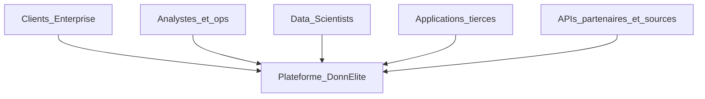
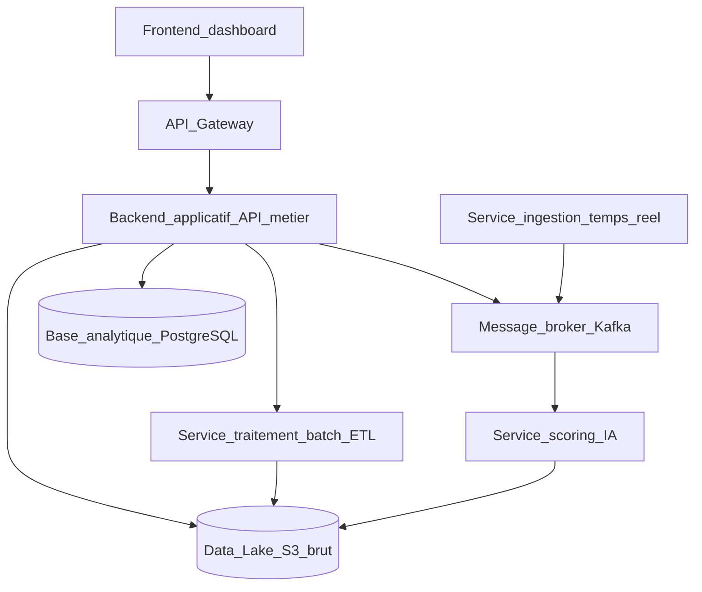
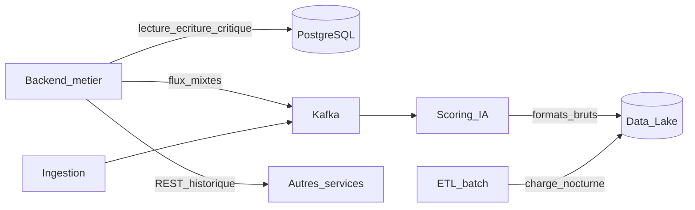

# Rapport d’audit du système d’information DonnÉlite

**Version :** 1.0 (finale)  
**Auteur :** Architecte logiciel — DonnÉlite  
**Destinataire :** Karyma, Head of Engineering  
**Date :** août 2026  
**Sources :** rapport technique architecture, contexte métier, dossier incidents / retours, schéma UML de l’architecture actuelle  

**Documents liés :** [README (index & glossaire)](README.md) · [02-definition-architecture.md](02-definition-architecture.md) · [03-dossier-integration.md](03-dossier-integration.md)

---

## 1. Objet et périmètre

Ce rapport reconstitue une vision exploitable du SI actuel de DonnÉlite afin d’identifier les limites techniques et fonctionnelles, les risques et les besoins d’évolution. Il ne propose **pas** d’architecture cible ni de solutions de remplacement ; ces éléments sont traités dans le document de définition d’architecture.

### 1.1 Périmètre analysé

- Collecte, traitement (batch et streaming partiel), stockage et exposition des données analytiques
- Scoring prédictif et consommation via dashboards / API
- Contraintes organisationnelles, économiques et de durabilité exprimées en interne

### 1.2 Hors périmètre

- Conception de la solution cible (livrable 02)
- Modalités d’intégration d’un nouveau composant (livrable 03)
- Estimation financière détaillée des coûts cloud

---

## 2. Hypothèses, constats et limites de l’analyse

Les documents fournis sont partiels et, pour certains points, potentiellement obsolètes. La grille ci-dessous distingue explicitement ce qui est **constat**, **hypothèse** ou **information manquante**.

| Élément | Nature | Commentaire |
|--------|--------|-------------|
| Liste des composants principaux (Gateway, ingestion, ETL, Kafka, Data Lake, PostgreSQL, scoring, backend, frontend) | Constat | Confirmé par le rapport technique et le schéma UML |
| Flux historiques contournant Kafka (REST direct) | Constat | Rapport technique + notes Engineering |
| Métriques 6 derniers mois (~18 To/j, batch 9h15, API 4–7 s, 6 incidents critiques/mois, ~30 % duplication, ~60 % services monitorés) | Constat (estimé) | Le rapport indique que certaines métriques ne sont pas consolidées |
| Cause racine exacte des incohérences dashboard / API | Hypothèse | Réunion incident : Kafka, ETL, cache backend ou duplication — non confirmée |
| Cause de l’incident #312 (perte données batch) | Information manquante | Cause inconnue ; hypothèse ETL |
| Cartographie exhaustive de tous les flux REST vs Kafka | Information manquante | Décisions historiques non documentées |
| Inventaire complet des versions de librairies | Information manquante | « Plusieurs versions coexistent » sans détail |
| Schéma de rétention Data Lake / PostgreSQL | Information manquante | Absence de stratégie claire signalée, sans politique écrite |
| Architecture « event-driven » ou introduction d’un data warehouse | Hypothèse évoquée | Non validée ni engagée |

**Limite méthodologique :** l’audit s’appuie sur des sources internes hétérogènes (technique, produit, SRE, clients). Les priorités métier (stabilité vs latence) peuvent diverger selon les interlocuteurs ; elles sont reportées telles quelles en section 6 et 8.

---

## 3. Modélisation du système existant

### 3.1 Vue contexte (C4 — niveau 1)

Version Draw.io : [diagrams/01-c4-contexte-actuel.drawio](diagrams/01-c4-contexte-actuel.drawio)

DonnÉlite centralise des données opérationnelles (retail, logistique, transport, finance) pour produire indicateurs, rapports et scores prédictifs consommés par des humains et des systèmes tiers.

### 3.2 Vue conteneurs (C4 — niveau 2)

Reconstitution à partir du schéma UML et du rapport technique.

Version Draw.io : [diagrams/02-c4-conteneurs-actuel.drawio](diagrams/02-c4-conteneurs-actuel.drawio)

**Remarque documentée :** certains flux contournent Kafka et passent encore par API REST synchrones entre services. Ces chemins ne figurent pas tous sur le schéma simplifié.

### 3.3 Stack technique observée

| Couche | Technologies |
|--------|----------------|
| Backend | Node.js et Python (hétérogène selon services) |
| Data / streaming | Kafka (usage partiel), Spark (batch) |
| Stockage | S3-compatible (Data Lake), PostgreSQL (analytique) |
| Infra | Docker non standardisé, déploiements manuels partiels |
| Auth | Service d’authentification interne |

### 3.4 Principaux flux de données

#### Flux A — Ingestion temps réel (partiel)

1. Sources / événements → service d’ingestion  
2. Ingestion → Kafka  
3. Kafka → service de scoring (modèles IA)  
4. Scoring → Data Lake  

#### Flux B — Traitement batch nocturne

1. Données brutes / sources batch (CSV, exports) → ETL Spark  
2. ETL → Data Lake (et, selon les pipelines, alimentation de la base analytique)  
3. Backend / dashboards lisent les résultats consolidés  

**Indicateur :** durée moyenne du pipeline batch nocturne **9 h 15**.

#### Flux C — Consultation et API

1. Utilisateur / application tierce → API Gateway → Backend métier  
2. Backend lit PostgreSQL analytique (et parfois le Data Lake)  
3. Frontend affiche indicateurs / rapports  

**Indicateur :** temps de réponse API aux pics **4 à 7 secondes**.

#### Flux D — Contournements historiques (REST)

Des échanges synchrones entre services (hors broker) créent des chemins parallèles aux flux Kafka. Impact probable : désynchronisation des vues dashboard vs API, difficulté de traçabilité.

### 3.5 Capacités fonctionnelles actuelles

| Capacité | Description | Niveau de maturité observé |
|----------|-------------|----------------------------|
| Collecte | APIs partenaires, CSV, apps métiers, événements | Opérationnel, intégrations souvent spécifiques |
| Consolidation | Nettoyage, enrichissement, agrégation surtout batch | Opérationnel mais fragile à la charge |
| Indicateurs / dashboards | Tableaux de bord, rapports | Opérationnel avec décalage de plusieurs heures possible |
| API analytiques | Intégration outils tiers, automatisation | Opérationnel mais latence et SLA sous pression |
| Scoring prédictif | Modèles préconfigurés (volumes, risques, anomalies) | Limité ; évolution de modèles difficile |

---

## 4. Analyse fonctionnelle

### 4.1 Forces

- Couverture bout-en-bout : de la collecte à l’exposition (dashboard + API)
- Présence d’un canal streaming (Kafka) et d’un Data Lake, base d’évolution
- Cas d’usage IA déjà en production (scoring)
- Clients multi-secteurs et demande Enterprise claire (opportunité commerciale)

### 4.2 Limites fonctionnelles (constats métier)

Sources : document contexte métier, emails produit / clients, feedback Data Scientists.

| Limite | Manifestation | Impact métier |
|--------|---------------|---------------|
| Fraîcheur des données | Indicateurs parfois à plusieurs heures ; quasi temps réel limité | Décisions opérationnelles retardées ; plaintes clients |
| Intégration de nouvelles sources | Développements spécifiques, adaptations manuelles des pipelines | Time-to-value trop long |
| Intégration / évolution des modèles IA | Dépendance aux formats Data Lake ; intervention Engineering fréquente | Vélocité Data Science faible |
| Expérience Enterprise | SLA 99,9 % exigé ; incidents impactant la logistique client | Risque contractuel et churn |
| Cohérence des canaux | Incohérences dashboard vs API signalées | Perte de confiance dans la donnée |
| Self-service analytics | Non couvert de façon satisfaisante aujourd’hui | Charge récurrente sur Engineering / Data |

### 4.3 Attentes stratégiques 2026 (contexte)

- Doubler le nombre de clients Enterprise  
- Réduire le délai de disponibilité des données analytiques  
- Permettre des déploiements plus fréquents de modèles IA  

Ces objectifs ne sont **pas** atteignables durablement avec le niveau de fragilité observé (incidents, batch long, couplages).

---

## 5. Analyse technique

### 5.1 Forces techniques

- Kafka et Spark déjà présents (compétence et infra partielles)
- Séparation conceptuelle ingestion / batch / scoring / serving
- Conteneurisation Docker amorcée

### 5.2 Faiblesses techniques

| Domaine | Constat | Conséquence |
|---------|---------|-------------|
| Architecture hybride | Stream + batch peu maîtrisés ; migrations non finalisées | Complexité, chemins multiples, dette |
| Scalabilité batch | Jobs nocturnes qui « ne tiennent pas la charge » ; relances manuelles | Indisponibilité des indicateurs le matin |
| Base analytique | PostgreSQL central partagé, couplé au backend | Latence API (#245), contention |
| Isolation | Manque d’isolation entre services / clients | Risque « noisy neighbor », difficulté SLA |
| Standardisation | Docker et déploiements hétérogènes ; versions de libs multiples | Onboarding et ops coûteux |
| Observabilité | ~60 % des services correctement monitorés | MTTD/MTTR élevés (reconstruction pipeline ~3 h) |
| Qualité / gouvernance data | Lake avec données non nettoyées ; ~30 % de duplication | Coûts, confusion, traitements redondants |
| Couplage scoring | Dépendance directe aux formats bruts du Data Lake | Frein à l’évolution des modèles |

### 5.3 Indicateurs techniques (6 derniers mois)

| Indicateur | Valeur observée | Lecture audit |
|------------|-----------------|---------------|
| Volume quotidien ingéré | ~18 To/jour | Charge élevée pour une base MVP historique |
| Croissance mensuelle | +12 % | Pression continue sur l’architecture |
| Pipeline batch nocturne | 9 h 15 | Fenêtre opérationnelle quasi saturée |
| Latence API aux pics | 4–7 s | Incompatible avec une expérience Enterprise fluide |
| Incidents critiques / mois | ~6 | Instabilité structurelle |
| Données dupliquées | ~30 % | Dette stockage et cohérence |
| Reconstruction pipeline en incident | ~3 h | Manque d’automatisation / runbooks |
| Services bien monitorés | ~60 % | Angle mort ops |

Croissance historique citée : **+300 %** de données ingérées, **+150 %** d’utilisateurs actifs depuis la phase MVP.

---

## 6. Étude des dépendances entre composants

### 6.1 Matrice des dépendances (principales)

| De → Vers | Gateway | Backend | Ingestion | Kafka | ETL | Scoring | PostgreSQL | Data Lake |
|-----------|---------|---------|-----------|-------|-----|---------|------------|-----------|
| Frontend | X | | | | | | | |
| Gateway | | X | | | | | | |
| Backend | | | | X (partiel) | X | | X | X |
| Ingestion | | | | X | | | | |
| Kafka | | | | | | X | | |
| ETL | | | | | | | ? | X |
| Scoring | | | | | | | | X |

`X` = dépendance documentée ; `?` = probable mais non explicitée dans les sources.

### 6.2 Dépendances critiques (points de fragilité)

1. **Backend ↔ PostgreSQL analytique**  
   Couplage fort. Toute surcharge analytique dégrade directement les API métier (incident #245 : latence > 5 s, scaling manuel).

2. **Ingestion ↔ traitement batch**  
   Forte dépendance signalée : les échecs ou retards batch impactent la disponibilité globale des données « fraîches » attendues le lendemain.

3. **Scoring ↔ Data Lake brut**  
   Le cycle de vie des modèles est collé aux formats bruts / peu gouvernés → vélocité IA faible.

4. **Kafka partiel + REST parallèle**  
   Deux paradigmes de communication coexistent → états divergents possibles (dashboard vs API).

5. **Data Lake comme hub implicite**  
   ETL, backend et scoring convergent vers le lake → point de concentration sans contrat de données clair.

### 6.3 Graphe simplifié des couplages à risque

Version Draw.io : [diagrams/03-dependances-critiques.drawio](diagrams/03-dependances-critiques.drawio)

---

## 7. Évaluation des risques et contraintes

### 7.1 Matrice de risques

Échelle : Impact / Probabilité de 1 (faible) à 5 (très élevé). Score = I × P.

| ID | Risque | Impact | Prob. | Score | Preuves / signaux | Priorité |
|----|--------|--------|-------|-------|-------------------|----------|
| R1 | Non-respect SLA API Enterprise (99,9 %) | 5 | 4 | 20 | Client Enterprise, incidents latence | Critique |
| R2 | Saturation / échec pipeline batch | 5 | 5 | 25 | Job nuit en échec, relances manuelles, 9h15 | Critique |
| R3 | Incohérence des données exposées (dashboard ≠ API) | 4 | 4 | 16 | Plaintes clients, réunion incident | Haute |
| R4 | Perte ou trou de données (ETL) | 5 | 3 | 15 | Incident #312 | Haute |
| R5 | Explosion des coûts cloud (stockage / compute) | 4 | 4 | 16 | Direction financière, +stockage, 30 % dup | Haute |
| R6 | Impossibilité d’intégrer rapidement sources / modèles | 4 | 4 | 16 | Produit, Data Scientists | Haute |
| R7 | Angle mort monitoring → MTTR élevé | 4 | 3 | 12 | 60 % monitorés, 3 h reconstruction | Moyenne |
| R8 | Dette de déploiement (Docker hétérogène) | 3 | 4 | 12 | Notes SRE | Moyenne |
| R9 | Décisions techniques non documentées | 3 | 5 | 15 | Historique MVP | Haute |

### 7.2 Contraintes à respecter lors de toute évolution

| Type | Contrainte |
|------|------------|
| Économique | Maîtriser la hausse des coûts cloud ; solutions soutenables à moyen terme |
| Opérationnelle | Continuité de service pendant la transition ; pas de big-bang de remplacement |
| Organisationnelle | Autonomie accrue Engineering / Data / Produit ; intégration progressive des composants |
| Durabilité | Réduire les duplications ; intégrer l’impact écologique dans les arbitrages |
| Produit | Préférence parfois pour **stabilité** (ex. 5 min de retard acceptable) plutôt que streaming total fragile |

### 7.3 Contradictions à noter (points de vigilance)

- Le schéma UML simplifie des flux que le texte décrit comme incomplets / contournés.  
- Data Engineering valorise la **maintenabilité du batch Spark** ; Produit / clients poussent le **quasi temps réel**.  
- Direction financière freine les coûts ; volume et duplication poussent à plus d’infra si on ne rationalise pas.  
- Objectif Enterprise (SLA strict) vs ~6 incidents critiques/mois et monitoring partiel.

---

## 8. Impacts écologiques et numériques

Aligné sur une démarche Green IT (mesure, réduction, sobriété).

### 8.1 Constats

| Facteur | Observation | Effet environnemental / numérique |
|---------|-------------|-------------------------------------|
| Duplication des données | ~30 % estimé | Stockage et I/O inutiles, énergie et coût |
| Absence de rétention claire | Données rarement supprimées | Croissance non maîtrisée du footprint |
| Jobs batch longs et gourmands | 9h15, échecs + relances | Compute répété, pics nocturnes |
| Redondance de traitements | Hypothèse liée aux incohérences | Double calcul possible sur mêmes données |
| Monitoring incomplet | 40 % non correctement monitorés | Sur-provisioning défensif probable |

### 8.2 Impacts numériques (usage et dette)

- Expérience utilisateur dégradée (latence, données obsolètes) → charge support / Customer Success  
- Charge cognitive des équipes (relances manuelles, chemins non documentés)  
- Frein à l’innovation (temps passé à stabiliser plutôt qu’à livrer des cas d’usage 2026)

### 8.3 Besoins de mesure (manquants aujourd’hui)

Sans métriques consolidées de stockage utile vs redondant, de kWh/job ou de taux de réutilisation des datasets, l’optimisation Green IT restera qualitative. L’audit recommande d’inclure ces indicateurs dans les besoins d’évolution (section 9), sans préjuger des outils.

---

## 9. Synthèse des besoins d’évolution du SI

Les besoins ci-dessous découlent de l’audit. Ils sont formulés en **capacités attendues**, pas en solutions techniques.

### 9.1 Priorisation

| Priorité | Besoin d’évolution | Motivations principales |
|----------|--------------------|-------------------------|
| P0 | Fiabiliser et raccourcir la disponibilité des données analytiques (cible indicative : minutes, pas heures) | Clients, produit, batch saturé |
| P0 | Isoler la charge analytique de la charge API pour respecter le SLA Enterprise | Incident #245, contrat 99,9 % |
| P0 | Réduire les chemins de données divergents (une vérité, traçabilité) | Incohérences dashboard/API |
| P1 | Standardiser l’intégration de nouvelles sources sans refonte majeure | Time-to-value, autonomie équipes |
| P1 | Découpler le cycle de vie des modèles IA des formats bruts du lake | Feedback Data Scientists |
| P1 | Améliorer observabilité et procédures d’incident (MTTD/MTTR) | 6 incidents/mois, 3 h rebuild |
| P2 | Politique de rétention, déduplication et zones de qualité des données | Coûts, Green IT, confiance |
| P2 | Homogénéiser packaging / déploiement | Notes SRE |
| P2 | Préparer le self-service analytics (exploration, indicateurs métier) | Cas d’usage stratégique |

### 9.2 Exigences non fonctionnelles dérivées

- **Disponibilité** : compatible avec engagements Enterprise (99,9 % sur APIs analytiques)  
- **Performance** : latence API stable sous charge (aujourd’hui 4–7 s aux pics — inacceptable)  
- **Évolutivité** : absorber +12 %/mois et la croissance clients Enterprise  
- **Maintenabilité** : réduire les interventions manuelles sur les pipelines  
- **Sobriété** : diminuer duplication et compute inutile  
- **Migration** : coexistence de l’existant pendant la transition  

### 9.3 Composants critiques à préserver / faire évoluer avec précaution

À ce stade d’audit (sans design cible) : Kafka (déjà partiel), Data Lake, Spark batch, API Gateway, backend métier et frontend représentent le **cœur opérationnel**. Toute évolution devra en tenir compte pour éviter une rupture de service.

---

## 10. Conclusion de l’audit

Le SI DonnÉlite est le fruit d’une croissance organique depuis un MVP retail : il **fonctionne** mais n’est plus aligné avec la volumétrie (~18 To/j), les exigences Enterprise et les ambitions IA / quasi temps réel. Les principaux freins sont le **couplage backend–PostgreSQL**, l’**architecture hybride mal finalisée**, la **fragilité du batch**, le **manque de contrats de données** et un **footprint stockage** gonflé par la duplication.

La suite de la mission consiste à répondre à ces besoins d’évolution via une architecture cible justifiée et un plan d’intégration progressif — voir [02-definition-architecture.md](02-definition-architecture.md).

---

## Annexe A — Inventaire des composants actuels

| Composant | Responsabilité | Criticité |
|-----------|----------------|-----------|
| Frontend dashboard | Visualisation indicateurs / rapports | Haute |
| API Gateway | Entrée unifiée, routage | Haute |
| Backend applicatif | API métier, orchestration lecture | Critique |
| Ingestion temps réel | Collecte événements / flux RT | Haute |
| Kafka | Bus de messages (usage partiel) | Haute |
| ETL batch (Spark) | Nettoyage, agrégations quotidiennes | Critique |
| Data Lake (S3) | Stockage brut | Critique |
| PostgreSQL analytique | Serving analytique / requêtes API | Critique |
| Service de scoring | Inférence modèles IA | Haute |
| Auth interne | Authentification | Haute |

## Annexe B — Références incidents

| Réf. | Symptôme | Cause suspectée | Correctif temporaire |
|------|----------|-----------------|----------------------|
| #245 | Latence API > 5 s | Surcharge PostgreSQL | Scaling manuel |
| #312 | Données manquantes dashboard | Erreur pipeline ETL (non confirmée) | Non documenté |

## Annexe C — Glossaire

Termes employés dans ce rapport. Pour le glossaire transverse (architecture cible, intégration), voir [README.md](README.md).

| Terme | Définition |
|-------|------------|
| API Gateway | Point d’entrée unifié du SI : routage des requêtes vers les services backend |
| Batch / ETL (Spark) | Traitement nocturne de nettoyage, enrichissement et agrégation des données (durée moyenne observée : 9 h 15) |
| C4 | Modèle de description d’architecture (ici : niveau contexte et niveau conteneurs) |
| Couplage | Dépendance forte entre composants ; un couplage critique lie par ex. le backend à PostgreSQL |
| Data Lake | Stockage objet S3-compatible des données brutes (et peu gouvernées) |
| Green IT | Démarche de sobriété numérique : mesure, réduction du footprint et arbitrages écologiques |
| Ingestion temps réel | Service de collecte d’événements / flux RT vers le broker Kafka |
| Kafka | Bus de messages (message broker) ; usage partiel dans le SI actuel, coexistant avec des flux REST |
| MTTD / MTTR | Mean Time To Detect / Mean Time To Repair — délais moyens de détection et de résolution d’incident |
| MVP | Minimum Viable Product — version initiale retail à partir de laquelle le SI a grandi organiquement |
| Noisy neighbor | Effet où la charge d’un client ou d’un service dégrade les performances des autres (manque d’isolation) |
| Observabilité | Capacité à monitorer le SI (métriques, logs, traces) ; ~60 % des services correctement monitorés |
| P0 / P1 / P2 | Priorités des besoins d’évolution formulés en §9 (P0 = critique) |
| PostgreSQL analytique | Base relationnelle servant les requêtes API et indicateurs ; point de contention actuel |
| Scoring (IA) | Service d’inférence de modèles prédictifs (volumes, risques, anomalies) consommant le Data Lake |
| SLA | Service Level Agreement — engagement contractuel de disponibilité (ex. 99,9 % Enterprise) |
| Streaming | Traitement quasi continu des données via le broker, par opposition au batch nocturne |
| Time-to-value | Délai entre le besoin (nouvelle source, cas d’usage) et la disponibilité effective de la donnée |
