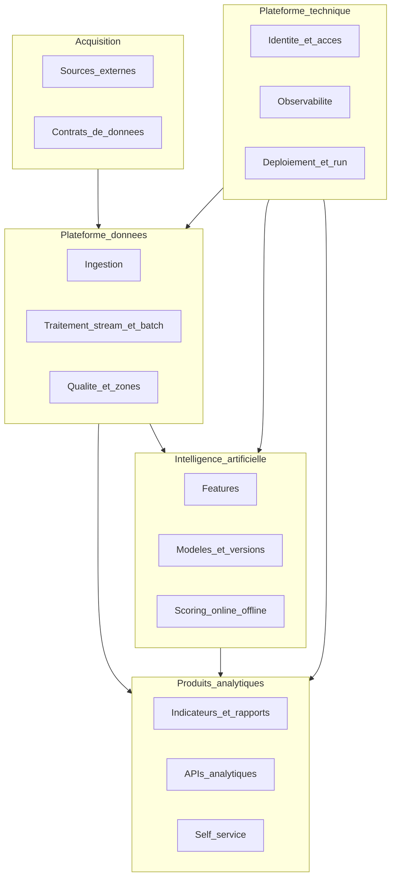
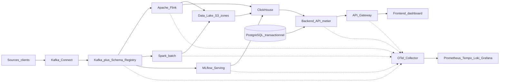
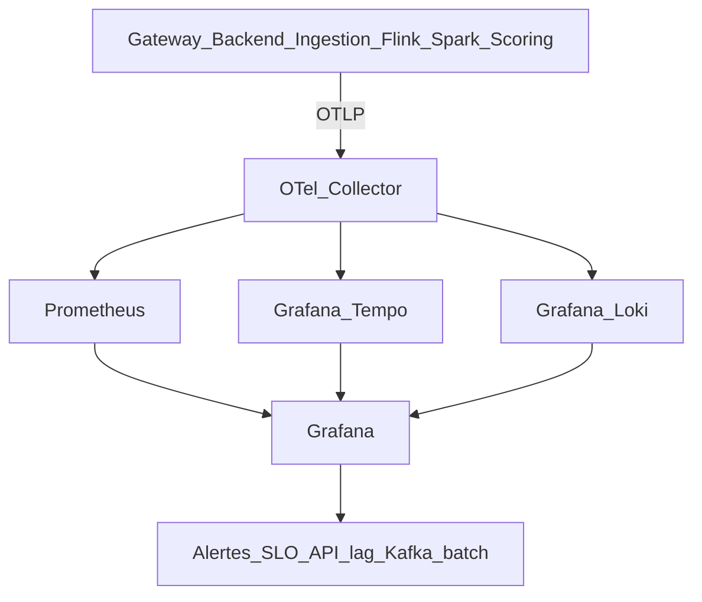
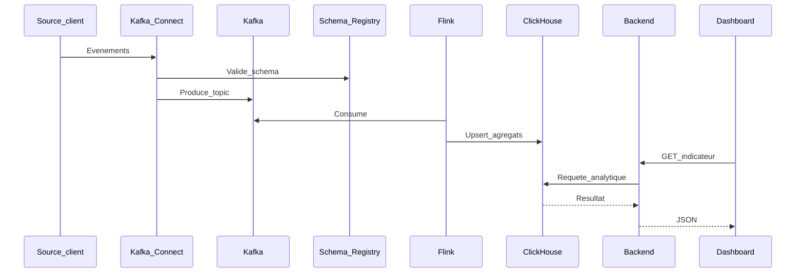
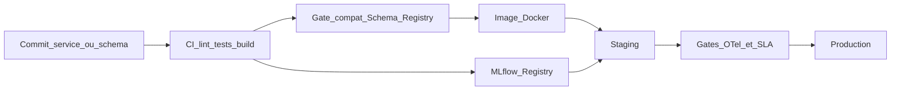

# Définition d’architecture du système cible — DonnÉlite

**Version :** 1.1 (finale)  
**Auteur :** Architecte logiciel — DonnÉlite  
**Destinataire :** Karyma, Head of Engineering  
**Date :** août 2026  
**Prérequis :** [01-rapport-audit.md](01-rapport-audit.md)  
**Suite :** [03-dossier-integration.md](03-dossier-integration.md)  
**Index / glossaire :** [README.md](README.md)

---

## 1. Objet du document

Ce document formalise l’architecture cible du SI DonnÉlite en réponse aux besoins d’évolution identifiés par l’audit. Il inclut :

- la modélisation du domaine métier ;
- la description de l’architecture cible ;
- un benchmark de solutions techniques ;
- la justification des choix retenus ;
- les interactions entre composants (existants et nouveaux) ;
- la sécurité, la continuité d’exploitation et le CI/CD cibles ;
- les critères d’acceptation.

**Principes directeurs :** migration progressive (pas de big-bang), réutilisation de Kafka / Spark / S3 / Gateway, maîtrise des coûts cloud, sobriété numérique (réduction duplication / rétention).

---

## 2. Modélisation du domaine métier

### 2.1 Bounded contexts

Version Draw.io : [diagrams/04-domaine-bounded-contexts.drawio](diagrams/04-domaine-bounded-contexts.drawio)

| Context | Responsabilité | Acteurs principaux |
|---------|----------------|-------------------|
| Acquisition | Connecter sources, valider schémas, garantir provenance | Data Engineering, partenaires |
| Plateforme données | Ingestion, transformation stream/batch, zones de qualité | Data Engineering |
| Produits analytiques | Indicateurs, API, dashboards, self-service | Produit, analystes, clients |
| IA | Features, entraînement, déploiement, scoring | Data Scientists, ML Eng. |
| Plateforme technique | Auth, monitoring, CI/CD, isolation multi-tenant légère | Engineering, SRE |

### 2.2 Concepts métier clés

| Concept | Définition |
|---------|------------|
| Source | Origine de données (API partenaire, CSV, app métier, événement) |
| Événement | Fait métier horodaté transitant sur le bus |
| Dataset de zone | Bronze (brut), Silver (nettoyé), Gold (servable) |
| Indicateur | Agrégat métier exposé dashboard / API |
| Modèle | Artefact versionné produisant un score |
| Contrat de données | Schéma + compatibilité + propriétaire |

### 2.3 Cas d’usage cibles couverts

| CU | Besoin audit / métier | Réponse architecturale |
|----|----------------------|------------------------|
| CU1 | Analyse quasi temps réel | Flink sur Kafka → couches Silver/Gold + alertes |
| CU2 | Intégration sources simplifiée | Kafka Connect + Schema Registry |
| CU3 | Déploiement fréquent des modèles | MLflow + serving découplé du brut |
| CU4 | Clients Enterprise | Serving ClickHouse, isolation, SLA, traçabilité |
| CU5 | Self-service analytics | Couche Gold gouvernée + outils BI sur ClickHouse |

---

## 3. Architecture du système cible

### 3.1 Vue d’ensemble

Version Draw.io : [diagrams/05-architecture-cible.drawio](diagrams/05-architecture-cible.drawio)

### 3.2 Composants : conservés, évolués, nouveaux

| Composant | Statut | Rôle cible |
|-----------|--------|------------|
| Frontend dashboard | Conservé | UI ; consomme API stables |
| API Gateway | Conservé | Entrée, auth, rate limiting Enterprise ; injection `traceparent` |
| Backend API métier | Évolué | Logique métier + lecture **ClickHouse** (analytique) ; PostgreSQL limité au transactionnel / métadonnées ; instrumentation OTel |
| Service ingestion RT | Évolué | Producteur Kafka standardisé (schémas) ; propagation trace dans headers |
| Kafka | Évolué / généralisé | Bus unique pour nouveaux flux ; fin progressive des contournements REST |
| **Schema Registry** | **Nouveau** | Contrats de schémas Avro/JSON Schema |
| **Kafka Connect** | **Nouveau** | Connecteurs sources (CDC, fichiers, HTTP) |
| ETL Spark batch | Conservé (périmètre réduit) | Jobs lourds historiques, repros, backfills ; métriques job + logs corrélés |
| **Apache Flink** | **Nouveau** | Traitements quasi temps réel, alertes |
| Data Lake S3 | Évolué | Zones bronze / silver / gold + TTL |
| PostgreSQL | Évolué (réduit) | Plus de serving analytique massif |
| **ClickHouse** | **Nouveau** | Serving analytique basse latence |
| Service scoring | Évolué | Consomme features / topics ; modèles via MLflow ; spans OTel |
| **MLflow** | **Nouveau** | Registry + déploiement versionné des modèles |
| Auth interne | Évolué | Renforcer isolation tenants / scopes API |
| **OpenTelemetry Collector** | **Nouveau** | Collecte unifiée traces / métriques / logs (OTLP) |
| **Prometheus** | **Nouveau** | Métriques et règles d’alerting SLO |
| **Grafana Tempo** | **Nouveau** | Stockage et requête des traces distribuées |
| **Grafana Loki** | **Nouveau** | Agrégation des logs corrélés aux `trace_id` |
| **Grafana** | **Nouveau** | Dashboards ops, exploration traces/logs, alertes |

### 3.3 Patterns architecturaux retenus

1. **Event-driven progressif (strangler fig)** — nouveaux flux et migrations via Kafka ; REST historiques encapsulés puis retirés.  
2. **Lambda pragmatique** — stream (Flink) pour fraîcheur ; batch (Spark) pour corrections et gros volumes.  
3. **Medallion (bronze / silver / gold)** — qualité progressive, moins de duplication anarchique.  
4. **CQRS léger** — écritures / événements séparés de la lecture analytique (ClickHouse).  
5. **Contrat-first data** — Schema Registry obligatoire pour les topics de production.  
6. **Observabilité by design** — trois piliers (métriques, traces, logs) corrélés via OpenTelemetry ; tout nouveau service expose OTLP avant mise en prod.

### 3.4 Flux cibles

#### Quasi temps réel (CU1)

Sources → Connect / ingestion → Kafka → Flink → Silver/Gold (S3) et/ou ClickHouse → API / alertes / dashboard.

#### Batch maîtrisé

Kafka ou lake bronze → Spark → silver/gold → ClickHouse (chargement périodique). Objectif : batch **&lt; 4 h**, plus de fenêtre saturée à 9h15.

#### Scoring IA (CU3)

Features (topics ou tables gold) → MLflow Serving / scoring → résultats vers Kafka et/ou ClickHouse. Le scoring **ne lit plus** le brut non contractuel comme dépendance principale.

#### Lecture Enterprise (CU4)

Gateway → Backend → ClickHouse (analytique) + PostgreSQL (état applicatif). Isolation par projet / tenant au niveau requêtes et quotas Gateway.

#### Observabilité répartie (réponse audit R7 / besoin P1)

Version Draw.io : [diagrams/08-observabilite-repartie.drawio](diagrams/08-observabilite-repartie.drawio)

**Propagation de contexte :**

- HTTP : W3C Trace Context (`traceparent` / `tracestate`) dès l’API Gateway.  
- Kafka : report du `traceparent` dans les **headers de message** (producteurs Node/Python ; consommateurs scoring / jobs).  
- Logs structurés JSON avec champ `trace_id` pour corrélation Loki ↔ Tempo.  

**Alertes minimales cibles :** latence API p95, taux d’erreur 5xx, lag consumer Kafka, durée / échec jobs Spark, DLQ non vide, saturation Collector.

---
## 4. Benchmark de solutions techniques

### 4.1 Serving analytique (réponse à la saturation PostgreSQL)

| Critère | PostgreSQL seul (statut quo) | Snowflake | **ClickHouse** |
|---------|------------------------------|-----------|----------------|
| Latence agrégats massifs | Faible à moyenne sous charge | Bonne | Excellente |
| Coût à volume DonnÉlite | CPU/IO élevés, scaling vertical limité | Élevé (SaaS) | Maîtrisé (self-hosted / cloud) |
| Intégration Kafka / S3 | Indirecte | Native cloud | Connecteurs / engins matures |
| Compétences équipe | Fortes | À acquérir | À monter (SQL proche) |
| Migration progressive | N/A | Remplacement net | Couche serving ajoutée |
| Green IT | Mauvaise si surcharge + retries | Dépend usage | Moins de compute pour mêmes agrégats |

**Retenu : ClickHouse** — meilleur compromis perf / coût / migration progressive. Snowflake écarté (coût et dépendance). Statu quo PostgreSQL écarté (R1/R2 audit).

### 4.2 Traitement quasi temps réel

| Critère | Spark Structured Streaming | Kafka Streams | **Apache Flink** |
|---------|----------------------------|---------------|------------------|
| Latence | Moyenne | Bonne | Excellente |
| Complexité ops | Équipe déjà Spark | Légère | Moyenne |
| Fenêtres / état | Bon | Bon (périmètre JVM) | Excellent |
| Alignement batch existant | Fort | Faible | Complémentaire |
| Cas alertes critiques | Possible | Possible | Adapté |

**Retenu : Apache Flink** pour le chemin « minutes ». Spark batch **conservé** pour les pipelines stables (souhait Data Engineering). Kafka Streams écarté comme moteur principal (moins adapté multi-langage / jobs data complexes DonnÉlite).

### 4.3 Intégration de sources

| Critère | Développements REST ad hoc | **Kafka Connect + Schema Registry** | iPaaS propriétaire |
|---------|----------------------------|--------------------------------------|--------------------|
| Time-to-source | Lent | Rapide si connecteur | Rapide |
| Gouvernance schémas | Faible | Forte | Variable |
| Coût licence | Faible | Faible (OSS) | Élevé |
| Alignement Kafka existant | Faible | Fort | Moyen |

**Retenu : Kafka Connect + Schema Registry.**

### 4.4 Cycle de vie ML

| Critère | Scoring actuel (collé au lake) | SageMaker / Vertex | **MLflow** |
|---------|--------------------------------|--------------------|------------|
| Déploiement versionné | Difficile | Oui | Oui |
| Lock-in cloud | Non | Fort | Faible |
| Coût | Caché (ops) | Élevé | Maîtrisé |
| Intégration custom | Limitée | Bonne | Bonne |

**Retenu : MLflow** (+ service de scoring évolué). Cloud ML managé écarté pour limiter coûts et lock-in à ce stade.

### 4.5 Observabilité répartie (réponse R7 / P1 audit)

| Critère | Datadog (APM SaaS) | ELK complet | **OTel + Prometheus + Tempo + Loki + Grafana** |
|---------|--------------------|-------------|--------------------------------------------------|
| Traces distribuées | Oui | Partiel / complexe | Oui (Tempo) |
| Corrélation logs ↔ traces | Oui | Possible | Native via `trace_id` |
| Coût à l’échelle DonnÉlite | Élevé (ingestion) | Infra lourde | Maîtrisé (OSS) |
| Lock-in | Fort | Moyen | Faible (OTLP standard) |
| Fit Node.js / Python | Excellent | Bon | Excellent (SDK OTel) |
| Compétences SRE | Faibles à monter | Fortes ELK | Montée Grafana déjà courante |

**Retenu : OpenTelemetry + Prometheus + Grafana Tempo + Loki + Grafana.** Datadog écarté (coût / dépendance). ELK complet écarté comme socle unique (complexité ops et moins adapté au tracing distribué moderne).

### 4.6 Synthèse du benchmark

| Besoin audit | Solution retenue | Alternative écartée |
|--------------|------------------|---------------------|
| Décharge PostgreSQL / SLA API | ClickHouse | Snowflake ; PG seul |
| Quasi temps réel | Apache Flink | Streaming Spark seul |
| Intégration sources | Kafka Connect + Schema Registry | REST ad hoc |
| Modèles IA | MLflow + serving découplé | Statu quo lake brut |
| Qualité / traçabilité | Contrats de schéma + zones | Status quo |
| Observabilité / MTTR (R7) | OTel + Prometheus + Tempo + Loki + Grafana | Datadog ; ELK seul |
| Green IT | Zones + TTL + dédup | Stockage sans rétention |

---
## 5. Justification architecturale globale

### 5.1 Réponse aux risques P0 de l’audit

| Risque audit | Mesure cible |
|--------------|--------------|
| R1 SLA API | ClickHouse + quotas Gateway ; PG hors chemin analytique critique |
| R2 Batch saturé | Flink pour l’essentiel « frais » ; Spark recentré ; SLO batch &lt; 4 h |
| R3 Incohérences | Bus Kafka généralisé + schémas ; une couche Gold pour dashboard et API |
| R7 Angle mort monitoring | Socle OTel + Grafana ; couverture ≥ 95 % ; traces bout-en-bout |

### 5.2 Respect des contraintes métier

- **Économique :** OSS self-hostable (ClickHouse, Flink, MLflow, Kafka, stack Grafana/OTel) ; réduction duplication → moins de stockage.  
- **Opérationnelle :** strangler fig ; coexistence REST temporaire.  
- **Organisationnelle :** contrats de données → autonomie Data / DS ; runbooks Grafana pour SRE.  
- **Durabilité :** medallion + TTL + moins de recomputes sur échecs batch ; rétention Tempo/Loki bornée.  
- **Produit :** fraîcheur en minutes **avec** stabilité (préférée à un streaming total fragile).

### 5.3 Hypothèses de conception

1. Les équipes peuvent monter en compétence Flink / ClickHouse / OTel avec accompagnement (spike + formation).  
2. Kafka cluster actuel (ou son successeur) peut être dimensionné pour devenir le bus canonique.  
3. Une partie des indicateurs Enterprise peut tolérer ~5 minutes de latence (retour Produit).  
4. PostgreSQL reste pertinent pour les données transactionnelles / métadonnées applicatives.  
5. Les services Node.js et Python peuvent être instrumentés via SDK OpenTelemetry sans réécriture majeure.

---

## 6. Interactions entre composants (existant + nouveau)

### 6.1 Matrice d’intégration

| Nouveau / évolué | Interagit avec | Mode d’interaction |
|------------------|----------------|--------------------|
| Schema Registry | Ingestion, Connect, Flink, Spark, Scoring | API registre ; sérialisation Avro/JSON Schema |
| Kafka Connect | Sources externes, Kafka | Connecteurs source → topics |
| Flink | Kafka, S3, ClickHouse | Consommation topics ; écriture lake / CH |
| ClickHouse | Flink, Spark, Backend | Inserts batch/stream ; SQL via backend |
| MLflow | Scoring, Data Scientists, CI | Registry modèles ; endpoints serving |
| Kafka généralisé | Backend, ETL, Scoring | Remplace progressivement REST internes data |
| OTel Collector | Gateway, Backend, Ingestion, Flink, Spark, Scoring, MLflow | OTLP (traces, metrics, logs) |
| Prometheus / Tempo / Loki | OTel Collector, Grafana | Stockage et requête des trois piliers |
| Grafana | Prometheus, Tempo, Loki, SRE | Dashboards, alertes, corrélation |
### 6.2 Séquence — nouvel indicateur quasi temps réel

Version Draw.io : [diagrams/06-sequence-indicateur-temps-reel.drawio](diagrams/06-sequence-indicateur-temps-reel.drawio)

### 6.3 Coexistence pendant la migration

| Phase | État |
|-------|------|
| 0 | Audit / socle Kafka + Schema Registry + **Collector OTel + Grafana** (métriques/lag minimaux) |
| 1 | Nouveaux flux via Kafka + schémas ; ClickHouse en lecture parallèle ; traces Gateway→Backend |
| 2 | Basculer API analytiques critiques vers ClickHouse ; Flink ; propagation `traceparent` Kafka |
| 3 | Réduire REST data path ; Spark recentré ; MLflow ; couverture OTel ≥ 95 % services |
| 4 | TTL lake, dédup, self-service sur Gold ; rétention Tempo/Loki optimisée (Green IT) |

Le détail opérationnel de la phase 0–1 pour Kafka / Schema Registry est dans [03-dossier-integration.md](03-dossier-integration.md). L’observabilité Kafka (lag, DLQ) s’adosse au socle OTel décrit en §3.4.

---

## 7. Sécurité

La sécurité cible formalise les briques déjà présentes (Auth interne, API Gateway) et les renforce pour les clients Enterprise, le bus Kafka et le serving analytique. Détail Kafka (SASL, ACL) : [03-dossier-integration.md](03-dossier-integration.md) §3.2.

### 7.1 Principes

| Principe | Application DonnÉlite |
|----------|----------------------|
| Moindre privilège | Rôles / scopes API et ACL Kafka limités au besoin métier |
| Défense en profondeur | Gateway (PEP) + Auth interne + ACL bus + rôles bases |
| Zero-trust léger aux frontières | Tout appel externe authentifié ; pas de confiance implicite inter-services data |
| Secrets hors code | Variables d’environnement / coffre ; jamais dans le dépôt |
| Traçabilité | Accès et flux critiques corrélés via OTel (`trace_id`) |

### 7.2 Identité et accès

| Couche | Mesure cible |
|--------|--------------|
| API Gateway | Auth, rate limiting Enterprise, injection `traceparent` ; point d’entrée unique (PEP) |
| Auth interne | Évolution vers scopes API et isolation multi-tenant légère (projet / tenant) |
| Backend / API métier | Contrôle d’accès par scope ; isolation des requêtes ClickHouse par tenant |
| Data / Kafka | ACL par topic et principal ; SASL (ou mTLS) en staging/prod ; dev local sans ACL |
| ClickHouse / PostgreSQL | Rôles lecture analytique vs écriture transactionnelle / métadonnées |
| MLflow | Accès registry restreint ; promotion de modèles traçable |

### 7.3 Données en transit et au repos

- **Transit :** TLS sur HTTP (Gateway → backend → clients) et canaux Kafka staging/prod.  
- **Repos :** chiffrement S3 (lake) selon politique cloud ; volumes sensibles selon standard infra.  
- **Contrats :** Schema Registry obligatoire sur topics de production (intégrité / compatibilité).  
- **Secrets :** rotation des credentials SASL / DB ; aucun secret dans images Docker.

### 7.4 Menaces et mesures (alignement audit)

| Menace / risque | Mesure architecture |
|-----------------|---------------------|
| Accès non autorisé API Enterprise | Gateway + Auth + scopes + quotas |
| Fuite / pollution de flux data (R3) | Contrats de schéma + ACL Kafka + Gold unique |
| Contournement REST non gouverné | Strangler fig : nouveaux flux via Kafka uniquement |
| Modèle / score non maîtrisé | MLflow versionné ; scoring découplé du brut |
| Angle mort ops (R7) | OTel + alertes ; audit des accès critiques (cible) |

---

## 8. Continuité d’exploitation

Répond à la contrainte audit « continuité de service pendant la transition ; pas de big-bang » et aux critères AN2 / AN6 (§10.2).

### 8.1 Objectifs de service

| Indicateur | Cible |
|------------|--------|
| Disponibilité API analytiques (mensuelle) | ≥ 99,9 % |
| RTO (bascules / incident service critique) | ≤ 15 minutes |
| RPO (selon couche — voir tableau §8.2) | Borné par rétention / backup |
| MTTD latence API (alerte Grafana) | ≤ 5 minutes (§3.4) |

### 8.2 RTO / RPO par composant critique

| Composant | RTO cible | RPO indicatif | Levier principal |
|-----------|-----------|---------------|------------------|
| API Gateway + Backend | ≤ 15 min | Quasi nul (stateless + PG) | Redéploiement ; bascule instance |
| Kafka (topics critiques) | ≤ 15 min | ≤ rétention topic (ex. 7 j) | Réplication multi-broker ; lag surveillé |
| Schema Registry / `_schemas` | ≤ 15 min | Backup topic critique | Restauration Registry |
| ClickHouse (serving) | ≤ 30 min | Rechargement depuis Gold / Kafka | Rebuild depuis lake / Flink |
| PostgreSQL transactionnel | ≤ 15 min | Backup PITR / snapshot | Restore testé |
| Data Lake S3 | ≤ 1 h (accès) | Versioning / TTL | Politique rétention |
| Flink / Spark | ≤ 30 min | Offset / checkpoint | Relance job idempotente |

### 8.3 Haute disponibilité et résilience

- **Kafka :** cluster multi-broker ; facteur de réplication ≥ 2 sur topics critiques ; producteurs idempotents.  
- **Serving :** ClickHouse pour l’analytique ; PostgreSQL hors chemin critique massif → moins de SPOF analytique.  
- **Migration :** strangler fig et phases 0–4 (§6.3) : aucune bascule big-bang ; coexistence REST temporaire contrôlée.  
- **Jobs :** retry automatique idempotent (lien AG3) pour limiter les interventions manuelles (~3 h de reconstruction signalées à l’audit).

### 8.4 Sauvegardes et PRA opérationnel

| Élément | Fréquence / politique | Validation |
|---------|----------------------|------------|
| Topic `_schemas` / Registry | Backup régulier (critique) | Restore en staging |
| PostgreSQL | Snapshots + rétention définie | Test restore périodique |
| Configs infra / compose | Versionnées (dépôt) | Redeploy depuis CI |
| Lake S3 | Versioning + TTL (Green IT) | Restauration objet si besoin |
| Runbooks | Grafana + procédures SRE | Exercice incident mineur |

**Alertes minimales** (déjà §3.4) : latence API p95, 5xx, lag Kafka, échec jobs Spark, DLQ non vide, saturation Collector — socle du PRA « détecter → contenir → restaurer ».

---

## 9. CI/CD et déploiement

Répond au risque audit **R8** (Docker hétérogène, déploiements manuels partiels) et au cas d’usage CU3 (déploiement fréquent de modèles).

### 9.1 État cible

| Domaine | Pratique cible |
|---------|----------------|
| Packaging | Images Docker standardisées par service (Node.js / Python) |
| CI | Lint, tests unitaires, build image ; **gate compatibilité Schema Registry (BACKWARD)** |
| CD | Promotion dev → staging → prod ; pas de déploiement prod hors pipeline |
| Qualité prod | Instrumentation OTel obligatoire avant mise en prod (§3.3) |
| ML | Entraînement → MLflow Registry → promotion staging → scoring (AF3) |
| Data | Évolution de schéma via CI Registry ; pas de publish « sauvage » en prod |

### 9.2 Flux CI/CD

Version Draw.io : [diagrams/09-cicd-deploiement.drawio](diagrams/09-cicd-deploiement.drawio)

### 9.3 Gates qualité

1. **Schémas :** compatibilité BACKWARD vérifiée en CI (détail [03-dossier-integration.md](03-dossier-integration.md)).  
2. **Services P0 :** pipeline CI/CD unique ; pas de script Docker ad hoc en prod.  
3. **Observabilité :** export OTLP actif en staging avant promotion.  
4. **Modèles :** seule une version MLflow taguée « staging/prod » est déployée sur le scoring.  
5. **Rollback :** redéploiement de l’image / version précédente dans le RTO (§8).

### 9.4 Périmètre outillage

L’architecture fixe les **pratiques** (CI, gates, Docker standard, MLflow) sans imposer un produit CI unique (GitHub Actions, GitLab CI, etc.) — choix laissé à l’Engineering tant que les gates ci-dessus sont respectés.

---

## 10. Critères d’acceptation

La solution cible est considérée **validée** lorsque les critères suivants sont mesurés et atteints (environnement de staging puis production par vagues).

### 10.1 Critères fonctionnels

| ID | Critère | Mesure | Seuil |
|----|---------|--------|-------|
| AF1 | Indicateurs prioritaires quasi temps réel | Délai événement → disponibilité dashboard/API | ≤ 5 minutes (p95) |
| AF2 | Intégration d’une nouvelle source « standard » | Délai calendaire sans refonte d’architecture | ≤ 5 jours ouvrés (connecteur existant) |
| AF3 | Déploiement d’une nouvelle version de modèle | Via MLflow jusqu’à scoring en staging | ≤ 1 jour ouvré |
| AF4 | Dashboard et API sur même indicateur Gold | Écart relatif | &lt; 0,1 % ou égalité bit-à-bit sur jeu de test |
| AF5 | Traçabilité | Présence schéma + producteur + version modèle sur flux critiques | 100 % des topics prod critiques |

### 10.2 Critères non fonctionnels

| ID | Critère | Seuil |
|----|---------|-------|
| AN1 | Latence API analytique (p95) hors incident | ≤ 500 ms |
| AN2 | Disponibilité API analytiques (mensuelle) | ≥ 99,9 % |
| AN3 | Durée pipeline batch résiduel | ≤ 4 h |
| AN4 | Taux de services instrumentés OTel (métriques + logs structurés + alerting Grafana) | ≥ 95 % |
| AN5 | Volume de données dupliquées inutiles | ≤ 10 % (vs ~30 % aujourd’hui) |
| AN6 | Continuité de service pendant bascules | Aucune interruption non planifiée &gt; RTO convenu (cible 15 min) — §8 |
| AN7 | Trace distribuée bout-en-bout sur flux pilote (Gateway → Backend → Kafka → consommateur) | Visible dans Tempo pour ≥ 99 % des requêtes test |
| AN8 | MTTD sur dépassement latence API (alerte Grafana) | ≤ 5 minutes |
| AN9 | Corrélation log ↔ trace (`trace_id`) sur services critiques | 100 % des services P0 instrumentés |
| AN10 | Auth + isolation tenant / scopes sur API Enterprise | 100 % des endpoints analytiques exposés |
| AN11 | TLS en transit (HTTP + Kafka staging/prod) et secrets hors dépôt | Oui (audit config) |
| AN12 | Backup Schema Registry / topic `_schemas` restauré avec succès en staging | ≥ 1 exercice réussi / trimestre |
| AN13 | Pipeline CI/CD standard (build + deploy staging) pour services P0 | 100 % des services P0 |
| AN14 | Compatibilité de schéma BACKWARD vérifiée en CI avant merge prod | 100 % des topics critiques |

### 10.3 Critères Green IT

| ID | Critère | Seuil |
|----|---------|-------|
| AG1 | Politique de rétention documentée et appliquée (lake + topics + Tempo/Loki) | Oui |
| AG2 | Réduction stockage redondant | −50 % du volume dupliqué identifié sous 12 mois |
| AG3 | Jobs batch en échec relancés automatiquement (idempotents) | ≥ 90 % sans intervention humaine |

### 10.4 Critères d’acceptation du socle d’intégration (composant Kafka / Schema Registry)

Détaillés et testables dans le dossier d’intégration ; résumé :

- Un producteur et un consommateur de référence valident un contrat de schéma en environnement de dev.  
- Un flux pilote n’utilise plus le contournement REST.  
- Documentation d’onboarding exécutable sans l’architecte.

---

## 11. Roadmap indicative

| Vague | Objectif | Composants |
|-------|----------|------------|
| V0 | Socle événements + observabilité | Kafka généralisé, Schema Registry, OTel Collector, Prometheus, Grafana (métriques/lag) |
| V1 | Serving, SLA et traces HTTP | ClickHouse, bascule lectures API, Tempo + instrumentation Gateway/Backend |
| V2 | Fraîcheur + propagation Kafka | Flink sur top N indicateurs, `traceparent` sur messages, Loki |
| V3 | Sources, IA et CI/CD homogène | Kafka Connect, MLflow, scoring découplé, pipelines Docker standard, couverture OTel élargie |
| V4 | Sobriété, self-service et PRA | TTL, dédup, BI sur Gold, rétention Tempo/Loki bornée, exercices restore Registry/PG |

---

## 12. Conclusion

L’architecture cible conserve le cœur utile de DonnÉlite (Kafka, Spark, S3, Gateway, backend, frontend) et y ajoute une **colonne vertébrale événementielle gouvernée** (Schema Registry, Connect), un **moteur stream** (Flink), un **serving analytique** (ClickHouse), une **usine ML** (MLflow) et un **socle d’observabilité répartie** (OpenTelemetry, Prometheus, Tempo, Loki, Grafana). Les volets **sécurité** (Auth, Gateway, ACL Kafka, TLS), **continuité d’exploitation** (RTO/RPO, HA, PRA) et **CI/CD** (pipelines, gates schémas/OTel, MLflow) cadrent l’exploitation et la migration. Ce design répond aux risques critiques de l’audit — y compris le monitoring partiel (R7) et la dette de déploiement (R8) — tout en respectant migration progressive, coûts et Green IT.

Prochaine étape opérationnelle : intégrer en premier le socle **Kafka + Schema Registry** (avec métriques de lag branchées sur Grafana) — [03-dossier-integration.md](03-dossier-integration.md).

---

## Annexe A — Glossaire

Termes employés dans ce document. Pour le glossaire transverse, voir [README.md](README.md) ; pour le vocabulaire du SI actuel, voir [01-rapport-audit.md](01-rapport-audit.md) (annexe C).

| Terme | Définition |
|-------|------------|
| ACL | Access Control List — contrôles d’accès Kafka limitant les droits par topic et principal |
| BACKWARD | Compatibilité de schéma : les nouveaux schémas restent lisibles par les consommateurs anciens |
| Bounded context | Découpage métier du domaine (§2.1) : Acquisition, Plateforme données, Produits analytiques, IA, Exploitation |
| Bronze / Silver / Gold | Zones medallion du Data Lake : brut → nettoyé → servable |
| ClickHouse | Base de serving analytique basse latence ; remplace PostgreSQL sur le chemin API critique |
| CQRS léger | Séparation des écritures / événements et de la lecture analytique (ClickHouse) |
| Flink | Moteur de traitement quasi temps réel sur Kafka (indicateurs, alertes) |
| Flux pilote | Premier flux migré REST → Kafka pour valider le socle d’intégration |
| Kafka Connect | Framework de connecteurs pour intégrer des sources (CDC, fichiers, HTTP) vers Kafka |
| MLflow | Registry et déploiement versionné des modèles IA vers le scoring |
| Observabilité répartie | Métriques, traces et logs corrélés via OpenTelemetry sur l’ensemble des services |
| OTLP | OpenTelemetry Protocol — protocole d’export vers le Collector |
| PEP | Policy Enforcement Point — point d’application des politiques d’accès (API Gateway) |
| PRA / HA | Plan de reprise d’activité / haute disponibilité (§8) |
| RTO / RPO | Recovery Time Objective / Recovery Point Objective — durée max de reprise / perte de données max tolérée |
| Schema Registry | Service de contrats de schémas (Avro/JSON Schema) pour les topics de production |
| Serving analytique | Couche de lecture optimisée pour dashboards et API (cible : ClickHouse) |
| Strangler fig | Migration progressive en encapsulant l’existant ; nouveaux flux via Kafka uniquement |
