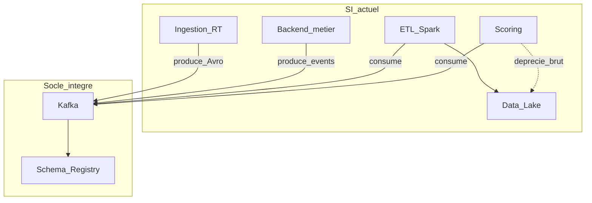

# Dossier d’intégration — Kafka + Schema Registry

**Version :** 1.0 (finale)  
**Auteur :** Architecte logiciel — DonnÉlite  
**Destinataire :** Karyma, Head of Engineering / équipes Engineering & Data  
**Date :** août 2026  
**Références :** [01-rapport-audit.md](01-rapport-audit.md) · [02-definition-architecture.md](02-definition-architecture.md) · [README (glossaire)](README.md)  
**Onboarding pratique :** [onboarding-kafka/README.md](onboarding-kafka/README.md)

---

## 1. Objet et périmètre

Ce dossier détaille l’intégration du **premier nouveau socle** retenu dans l’architecture cible :

> **Apache Kafka généralisé + Confluent Schema Registry**  
> (contrats de données + bus événementiel canonique)

Il couvre :

1. l’analyse de compatibilité avec le SI actuel ;  
2. les modalités de configuration et d’intégration ;  
3. la documentation d’onboarding de l’environnement de développement.

**Hors périmètre immédiat :** déploiement production HA, ClickHouse, Flink, MLflow (vagues suivantes de la roadmap architecture).

---

## 2. Composant retenu et motivations

| Élément | Choix |
|---------|--------|
| Broker | Apache Kafka (déjà partiellement en place) |
| Gouvernance | Schema Registry (nouveau) |
| Sérialisation recommandée | Avro (prod) ; JSON Schema acceptable en phase d’apprentissage |
| Stratégie | Strangler fig — nouveaux flux via Kafka ; REST data path déprécié progressivement |

**Pourquoi ce composant en premier :** il débloque le découplage ingestion / traitement (besoins P0/P1 de l’audit), prépare Flink et ClickHouse, et maximise le réemploi de compétences Kafka déjà présentes.

---

## 3. Analyse de compatibilité

### 3.1 Composants SI actuels concernés

| Composant actuel | Compatibilité | Impact | Action d’intégration |
|------------------|---------------|--------|----------------------|
| Service d’ingestion temps réel | Haute | Doit produire avec schéma enregistré | Adapter sérialiseurs ; topics nommés |
| Message broker Kafka existant | Haute | Cluster peut héberger Registry en annexe | Vérifier version broker ≥ 3.x ; topic `_schemas` |
| Service de scoring IA | Moyenne | Consomme aujourd’hui via Kafka **et** lit le lake | Phase 1 : consommer topics versionnés ; lake en secours |
| ETL Spark batch | Haute | Spark sait lire Kafka + Avro | Jobs pilotes en lecture topics silver |
| Backend API métier | Moyenne | Publie/consomme parfois en REST direct | Introduire producteur async pour événements métier ; ne plus appeler scoring en synchrone pour les nouveaux flux |
| Data Lake S3 | Haute | Reste sink | Connecteur sink ou jobs Flink/Spark (plus tard) |
| PostgreSQL analytique | Indirecte | Non modifié par ce socle | Bénéficie plus tard via ClickHouse |
| Frontend / API Gateway | Nulle directe | Aucun changement UI | Transparent |

### 3.2 Contraintes techniques du composant

| Contrainte | Détail | Mitigation |
|------------|--------|------------|
| Ordre et partitions | Clé de partition = identifiant métier (ex. `client_id`) | Convention documentée |
| Compatibilité de schémas | Évolutions BACKWARD (défaut DonnÉlite) | CI de compatibilité Registry |
| Rétention | Topics trop longs = coût ; trop courts = perte pour batch | TTL par type de topic (voir §4) |
| Idempotence / exactly-once | At-least-once par défaut | Producteurs idempotents ; consommateurs offset commit après traitement |
| Sécurité | ACL + auth (prod) | Dev local sans ACL ; staging avec SASL |
| Charge | +12 %/mois volume | Capacity planning partitions / brokers |
| Coexistence REST | Double écriture temporaire possible | Feature flag ; bascule lecture puis arrêt REST |

### 3.3 Risques d’intégration et impacts sur le SI actuel

| Risque | Impact SI | Probabilité | Mitigation |
|--------|-----------|-------------|------------|
| Double publication REST + Kafka | Incohérences temporaires (déjà un symptôme audit) | Moyenne | Un seul chemin « source de vérité » par flux pilote |
| Schéma mal versionné | Casse consommateurs scoring / Spark | Moyenne | Compatibilité BACKWARD + revue Data |
| Cluster Kafka sous-dimensionné | Latence / lag | Moyenne | Monitoring lag consumer ; alertes |
| Courbe d’apprentissage Avro | Retard équipes | Faible | Exemples JSON Schema + Avro dans onboarding |
| Topic `_schemas` non sauvegardé | Perte contrats | Faible | Backup Registry / topic critique |

### 3.4 Matrice de compatibilité synthétique



Version Draw.io : [diagrams/07-compatibilite-integration-kafka.drawio](diagrams/07-compatibilite-integration-kafka.drawio)

---

## 4. Modalités de configuration et d’intégration

### 4.1 Conventions de nommage des topics

```
<domaine>.<entite>.<version_majeure>
```

Exemples :

- `logistique.shipment_event.v1`
- `retail.pos_transaction.v1`
- `ia.score_risk.v1`

Topics techniques :

- `_schemas` — Schema Registry  
- `dlq.<topic_origine>` — dead letter  

### 4.2 Politique de schémas

| Paramètre | Valeur DonnÉlite |
|-----------|------------------|
| Compatibilité par défaut | `BACKWARD` |
| Subject naming | `TopicNameStrategy` : `<topic>-value` / `<topic>-key` |
| Champs obligatoires événement | `event_id`, `event_time`, `producer`, `tenant_id` |
| Évolution | Ajout de champs optionnels uniquement sans bump majeur |

### 4.3 Rétention et sobriété (Green IT)

| Type de topic | Rétention | Justification |
|---------------|-----------|---------------|
| Événements métier bruts | 7 jours | Rejeu court ; raw durable dans lake bronze |
| Agrégats / scores | 3 jours | Serving dans ClickHouse ensuite |
| DLQ | 14 jours | Analyse incidents |
| `_schemas` | Illimitée (compacted) | Contrats critiques |

### 4.4 Étapes d’intégration dans le SI existant

#### Étape A — Préparation cluster

1. Valider version Kafka et accès réseau ingestion / Spark / scoring / backend.  
2. Déployer Schema Registry (même VPC / réseau que les brokers).  
3. Créer le topic `_schemas` (compacted) si non auto-créé.  
4. Configurer `schema.compatibility.level=BACKWARD` au niveau global.

#### Étape B — Flux pilote (strangler)

1. Choisir **un** flux aujourd’hui en REST (ex. événements d’ingestion → scoring).  
2. Définir le schéma v1 et l’enregistrer.  
3. Faire produire l’ingestion vers le topic (feature flag).  
4. Brancher un consommateur scoring **en parallèle** de l’ancien chemin.  
5. Comparer résultats (shadow traffic) pendant une fenêtre définie (ex. 7 jours).  
6. Basculer la lecture scoring sur Kafka uniquement ; déprécier REST.

#### Étape C — Généralisation

1. Catalogue des flux REST restants (dette audit).  
2. Migration par vague (priorité P0 : flux liés aux incohérences dashboard/API).  
3. Interdire nouveaux flux data synchrones sans exemption Architecture.

#### Étape D — Observabilité (Kafka + socle réparti)

Métriques Kafka minimales (phase V0) :

- Lag consumer par group  
- Taux d’erreur sérialisation / incompatibilité schéma  
- Volume messages / s et taille moyenne  
- Alertes DLQ non vide  

Ces signaux sont exposés vers **Prometheus / Grafana**, dans le cadre du socle d’observabilité répartie de l’architecture cible (OpenTelemetry Collector, Tempo, Loki) — voir [02-definition-architecture.md](02-definition-architecture.md) §3.4 et [diagrams/08-observabilite-repartie.drawio](diagrams/08-observabilite-repartie.drawio).

Dès le flux pilote : propager `traceparent` dans les headers Kafka et corréler les logs scoring / ingestion via `trace_id`.

### 4.5 Paramètres de configuration de référence

Fichiers prêts à l’emploi : [onboarding-kafka/config/](onboarding-kafka/config/).

**Schema Registry (extrait)**

```properties
listeners=http://0.0.0.0:8081
kafkastore.bootstrap.servers=kafka:9092
schema.compatibility.level=BACKWARD
```

**Producteur (extrait)**

```properties
bootstrap.servers=localhost:9092
acks=all
enable.idempotence=true
key.serializer=...StringSerializer
value.serializer=...KafkaAvroSerializer
schema.registry.url=http://localhost:8081
```

**Consommateur (extrait)**

```properties
group.id=scoring-pilot
enable.auto.commit=false
auto.offset.reset=earliest
specific.avro.reader=true
schema.registry.url=http://localhost:8081
```

### 4.6 Impacts sur les équipes

| Équipe | Changement |
|--------|------------|
| Data Engineering | Possède les topics et schémas ; revue compatibilité |
| Backend | Producteurs d’événements métier ; fin des appels REST data pour nouveaux cas |
| Data Science / Scoring | Consommation contractuelle ; moins de dépendance aux fichiers bruts |
| SRE | Monitoring lag, Registry, backups topic `_schemas` ; alertes Grafana (socle OTel) |
| Produit | Priorise les flux pilotes selon valeur client |

---

## 5. Environnement de développement et onboarding

### 5.1 Objectif

Permettre à **toute** personne Engineering / Data de démarrer Kafka + Schema Registry **sans aide directe de l’architecte**, sur machine locale (Docker Compose).

### 5.2 Contenu livré

Répertoire : [`projet/livrables/onboarding-kafka/`](onboarding-kafka/)

| Élément | Rôle |
|---------|------|
| `docker-compose.yml` | Zookeeper/KRaft Kafka + Schema Registry |
| `config/` | Propriétés de référence |
| `examples/producer.py` | Publication d’événements avec schéma |
| `examples/consumer.py` | Consommation et validation |
| `examples/schemas/shipment_event.avsc` | Contrat exemple |
| `README.md` | Guide pas-à-pas + smoke tests |
| `.env.example` | Variables d’environnement |

### 5.3 Prérequis développeur

- Docker et Docker Compose  
- Python 3.10+  
- Ports libres : `9092` (Kafka), `8081` (Schema Registry)

### 5.4 Smoke tests d’acceptation onboarding

1. `docker compose up -d` → Registry répond `GET /subjects`.  
2. Producteur enregistre le schéma et publie ≥ 1 message.  
3. Consommateur lit le message avec les champs métier attendus.  
4. Une évolution de schéma **incompatible** est **refusée** par le Registry (démonstration BACKWARD).

Le détail des commandes est dans le README d’onboarding.

### 5.5 Passage staging / production (aperçu)

| Sujet | Dev | Staging / Prod |
|-------|-----|----------------|
| Auth | Aucune | SASL/SCRAM ou mTLS |
| ACL | Ouvertes | Least privilege par service |
| Replication | 1 | ≥ 3 |
| Registry | Single | HA derrière LB |
| Observabilité | Logs compose | OTel/Prometheus/Grafana + lag Kafka + traces |

---

## 6. Plan de validation de l’intégration

| ID | Test | Résultat attendu |
|----|------|------------------|
| IT1 | Compatibilité ingestion → topic → scoring (pilote) | Parité fonctionnelle avec ancien chemin |
| IT2 | Évolution schéma BACKWARD | Consommateurs v1 non cassés |
| IT3 | Arrêt REST sur flux pilote | Aucune régression API dashboard sur jeu de test |
| IT4 | Restart consommateur | Reprise sans perte hors rétention |
| IT5 | Onboarding cold start | Nouvel arrivant termine le README en &lt; 1 h |

Ces tests contribuent aux critères AF4, AF5 et socle d’intégration du document d’architecture.

---

## 7. Synthèse

L’intégration de **Kafka + Schema Registry** est compatible avec l’existant DonnÉlite, à faible lock-in, et constitue le prérequis des vagues Flink / ClickHouse / MLflow. La stratégie strangler limite le risque opérationnel tout en attaquant les causes racines des incohérences et du couplage sync.

**Démarrage immédiat pour les équipes :** suivre [onboarding-kafka/README.md](onboarding-kafka/README.md).

---

## Annexe A — Glossaire

Termes employés dans ce dossier. Pour le glossaire transverse, voir [README.md](README.md) ; architecture cible : [02-definition-architecture.md](02-definition-architecture.md) (annexe A).

| Terme | Définition |
|-------|------------|
| ACL | Access Control List — droits Kafka par topic et principal (ouverts en dev ; least privilege en staging/prod) |
| At-least-once | Garantie de livraison par défaut : un message peut être relu ; compensée par producteurs idempotents et commit d’offset après traitement |
| Avro | Format de sérialisation binaire recommandé en production, associé au Schema Registry |
| BACKWARD | Compatibilité de schéma : les nouveaux schémas restent lisibles par les consommateurs anciens (défaut DonnÉlite) |
| Broker | Nœud du cluster Kafka qui stocke et sert les partitions des topics |
| Compacted (topic) | Mode de rétention qui conserve la dernière valeur par clé (ex. `_schemas`) |
| Consumer group | Ensemble de consommateurs partageant la lecture d’un topic ; le lag se mesure par groupe |
| DLQ | Dead Letter Queue — topic `dlq.<origine>` pour messages non traitables (rétention 14 jours) |
| Flux pilote | Premier flux migré REST → Kafka pour valider le socle avant généralisation |
| Lag | Retard de consommation : écart entre le dernier offset produit et celui consommé |
| Offset | Position d’un message dans une partition ; commit après traitement pour reprise sans perte hors rétention |
| Partition | Subdivision d’un topic ; la clé (ex. `client_id`) détermine l’ordre par entité métier |
| Producteur / Consommateur | Applications qui publient ou lisent des messages Kafka (avec sérialiseurs liés au Registry) |
| Rétention | TTL des messages sur un topic (ex. 7 j bruts, 3 j agrégats) avant expiration |
| SASL / SCRAM | Authentification Kafka en staging/prod (dev local sans auth) |
| Schema Registry | Service de contrats de schémas (Avro/JSON Schema) ; topic technique `_schemas` |
| Shadow traffic | Lecture parallèle ancien chemin REST + Kafka pour comparer les résultats avant bascule |
| Strangler fig | Migration progressive : nouveaux flux via Kafka ; REST data path déprécié progressivement |
| Subject | Identifiant de schéma au Registry (`TopicNameStrategy` : `<topic>-value` / `<topic>-key`) |
| Topic | File de messages nommée (`<domaine>.<entite>.vN`) ; canal canonique des événements |
| `_schemas` | Topic technique compacté du Schema Registry ; critique à sauvegarder |
